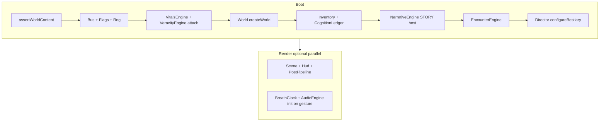

# Ironlung Maze / 邪教迷城 — 整合层 API 参考

> 本文档**仅依据** `src/**/*.ts` 中的实际导出与签名编写（2026-03 源码快照）。  
> 整合层应通过各模块的**门面** import，不要深入内部实现文件。

---

## 全局基础设施

### 事件总线 `Bus`（`src/core/events.ts`）

```typescript
import { Bus } from '../core/events';
import type { EventBus, GameEvents } from '../core/contract';

const bus: EventBus = new Bus();
bus.traceEnabled = true; // 可选：调试 trace
```

| 方法 | 签名 |
|------|------|
| `on` / `once` / `off` / `emit` | 与 `EventBus` 一致，键为 `keyof GameEvents` |

### 旗标 `Flags`（`src/core/flags.ts`）

```typescript
import { Flags } from '../core/flags';

const flags = new Flags(bus, () => breathsElapsed);
```

实现 `FlagStore`（`get` / `getNum` / `getBool` / `set` / `add` / `has` / `all`）。

### RNG（`src/core/rng.ts`）

```typescript
import { Xoshiro } from '../core/rng';
const rng: Rng = new Xoshiro(seed, 'session');
```

---

## 1. sim（`src/sim/index.ts`）

### 门面导出

| 符号 | 来源 |
|------|------|
| `VitalsEngine`, `VeracityEngine`, `Director` | 类 |
| `TUNING`, `BASELINE`, `THRESHOLDS`, `TRACKED_VITALS`, `DEPTH_RANGE` | `./tuning.ts` |
| `STATUS_*`, `makeStatus`, … | `./status.ts` |
| 类型 `BreathHoldState`, `DeathRecord`, `ExhaleResult`, `ObservedAction`, `PerceptionFilter`, `VeracityDriveInput`, `TrackedVital` | `./types.ts` / `./tuning.ts` |

---

### 1.1 `VitalsEngine`

**构造**

```typescript
new VitalsEngine(init?: {
  oxygenMax?: number;   // 默认 TUNING.oxygen.startMax (680)
  sanMax?: number;      // 默认 TUNING.san.max (100)
  bus?: EventBus;
  carryOver?: readonly ID[];  // 跨轮回 status id，makeStatus 后 apply
})
```

**接线**

```typescript
vitals.attachBus(bus);
vitals.attachPerception(veracity); // VeracityEngine 满足 PerceptionFilter
```

`PerceptionFilter`（`src/sim/types.ts`）要求：`corruption`, `number(raw, stat)`, `update(VeracityDriveInput)`。`VitalsEngine.advance` 每步在内部调用 `filter?.update(...)`，**无需**再单独调 `veracity.update`。

**每呼吸 / 固定步（`fixedUpdate`）**

| 方法 | 参数 | 返回 | 说明 |
|------|------|------|------|
| `advance(breaths, ctx, opts?)` | `ctx: SimContext`, `opts?.exertion?: 0..1` | `SimEvent[]` | 主推进；结束时 `emit('vitals:change')` |
| `holdBreath()` | — | `boolean` | 开始屏息 |
| `release()` / `gasp()` | — | `ExhaleResult` | 吐气 / 强制大喘；含 `noise` 需交给 world |
| `takeNoise()` | — | `number` | 取走 pending 噪音后清零 |

**按需（玩家输入 / 叙事 / 遭遇）**

| 方法 | 说明 |
|------|------|
| `apply` / `applyById` / `remove` / `has` / `stacksOf` | 状态效果 |
| `derived(stat: DerivedStat)` | 派生属性（整合层应把 inventory 的 `weightPenalty()` 等叠进 modifier 或调用前算倍率） |
| `costOf(baseBreaths)` | 实际呼吸成本 |
| `shock` / `injure` / `infect` / `restore` / `rewardDebunk` / `kill` | 外部冲击 |
| `holdState()` / `breathsUntilForcedGasp()` | HUD / 音频 |
| `heartRateBpm()` / `breathWave(time)` | 表现层 |
| `perceived()` | **HUD 唯一应读的 Vitals** |
| `serialize` / `hydrate` | 存档 |

**发出的事件（Bus）**

| 事件 | 触发 |
|------|------|
| `vitals:change` | 每次 `advance` 结束 |
| `log` | 屏息、大喘、自戕等 |
| `death` | `{ cause: DeathCause }` |

**未上 Bus 的产出**：`SimEvent[]`（含 `vitals-threshold`, `status-*`, `death`, `hallucination`）— 整合层需消费并可选转发。

**`SimContext` 字段来源**

```typescript
{
  rng: sessionRng.fork('vitals'),
  depth: world.depth,  // 或 deckDepth
  ambient: world.room(world.currentRoomId).ambient,
  flags,
}
```

**最小片段**

```typescript
const vitals = new VitalsEngine({ bus, carryOver: meta.statusCarry });
vitals.attachPerception(veracity);

function spendBreaths(n: number, reason: string, exertion = 0.25) {
  const events = vitals.advance(n, simCtx, { exertion });
  bus.emit('breath:spent', { amount: n, reason });
  for (const e of events) {
    if (e.kind === 'death') { /* phase → death */ }
    if (e.kind === 'hallucination') { /* 导演/veracity */ }
  }
  world.addNoise(world.currentRoomId, vitals.takeNoise());
}
```

**依赖顺序**：可在 `Flags`、初始 `rng` 之后构造；需在 `VeracityEngine` 构造后 `attachPerception`（若要用 `rewardDebunk` 闭环，构造 veracity 时传入 `vitals: { rewardDebunk: () => vitals.rewardDebunk() }`）。

---

### 1.2 `VeracityEngine`

**构造**

```typescript
new VeracityEngine(init?: {
  seed?: number;        // 默认 0x5eed1e
  bus?: EventBus;
  vitals?: { rewardDebunk(): void };
  lucidity?: number;    // 跨轮回永久清明
})
```

**每呼吸**：由 `VitalsEngine` 经 `PerceptionFilter.update` 驱动（见上）。若未 attach，可手动：

```typescript
veracity.update({ vitals, depth, stigmaListening, effectLucidity, breathsElapsed, dt });
```

**渲染 / UI（`render` 或叙事文本）**

| 方法 | 用途 |
|------|------|
| `text(raw, kind: 'ui' \| 'dialogue' \| 'log' \| 'item')` | 污染字符串 |
| `number(raw, stat)` | HUD 漂移 |
| `trustworthy('real' \| 'phantom')` | 声呐/地图可信度 |
| `shouldPhantom(rng)` / `shouldFabricate(rng, kind)` / `forge(kind, rng)` | 整合层处理 `DirectorOrder` |
| `debunk(id)` | 识破 |
| `invalidate()` | 读档 / 场景切换后清缓存 |
| `setBias` / `clearBias` | 导演个性化 |

**Bus**：`lie:born`, `lie:debunked`

**陷阱**：`stigmaListening` 在 vitals 内来自 `flags.getNum('stigma.listening', 0)`（见缺口清单）。

---

### 1.3 `Director`

**构造**：无参 `new Director()`。

**每呼吸（`fixedUpdate`）**

```typescript
const orders = director.tick({
  vitals: vitals.vitals,  // 真值，非 perceived
  world,
  flags,
  breathsElapsed,
  rng: rng.fork('director'),
});
for (const o of orders) bus.emit('director:order', o);
```

**行为画像**

```typescript
director.observe({ kind: 'sonar', power: 0.9 }); // ObservedAction 联合类型
director.configureBestiary([{ id, minDeck, weight, stealthy }]); // 应用 bestiary id
```

**只读**：`tension`, `intensity`, `currentPhase`, `stats`

**Bus**：无直接 emit；整合层应对 `orders` 发 `director:order`。

**陷阱**：默认兽栏 id 为 `ent.crawler` 等，与 `content/bestiary` 的 `ent.listener` 等不一致，必须 `configureBestiary`。

---

### 1.4 调参常量

- **`TUNING`**：全部平衡魔数（oxygen/co2/director/veracity/…）
- **`BASELINE`** / **`DERIVED_BOUNDS`**（tuning 内）：派生属性基线与边界
- **`THRESHOLDS`** / **`THRESHOLD_IS_PERCENT`**：阈值阶梯；穿越时 SimEvent `vitals-threshold`
- **`DEPTH_RANGE`**：`[340, 2100]` 米，用于深度归一化

---

## 2. world（`src/world/index.ts`）

### 门面导出（摘要）

| 符号 | 说明 |
|------|------|
| `World`, `createWorld(seed?, cfg?)` | 运行时 |
| `WorldRuntime`, `WorldTurnOutput`, `WorldLogLine` | 类型 |
| `DEFAULT_WORLD_CONFIG`, `generateWorld`, `spawnPhantomRoom` | 生成 |
| `sweep`, `toSonarResult`, `SONAR_MODES`, … | 低级声呐工具 |
| `reweave`, `markDoor`, `solve`, … | 拓扑 / 求解 |
| `assertWorldContent()` | 启动自检 |

---

### 2.1 `World`

**构造**

```typescript
const world = new World(seed, DEFAULT_WORLD_CONFIG);
// 等价 createWorld(seed, cfg)
```

**运行时注入（整合层每帧或每回合前同步）**

```typescript
world.configure({
  san: vitals.vitals.san,
  corruption: veracity.corruption,
  breaths: breathsElapsed,
  cycle,
  keys: keySet,              // 叙事/背包解锁
  entities: entityHints,     // 遭遇/导演 spawn 的位置
  knowsSonarTell: flags.getBool('know...'),
  sonarRangeMul: vitals.derived('sonarRange') / BASELINE.sonarRange,
  sonarFidelityMul: vitals.derived('sonarFidelity') / BASELINE.sonarFidelity,
  noiseMul: vitals.derived('noiseEmission'),
  stealth: vitals.derived('stealth'),
  stigmaTotal: sum(stigmata),
});
```

**玩家动作（回合制，非 rAF）**

| 方法 | 返回 | 说明 |
|------|------|------|
| `move(doorId)` | `MoveResult` | 含 `cost`, `noise`, `events`；整合层扣 breath + `addNoise` |
| `ping(power, fidelity)` | `SonarResult` | 契约简化 API；`power`→模式见 `modeFromPower` |
| `sonar(mode, { absoluteFidelity? })` | `SonarSweep` | 完整回波/破绽 |
| `reweave(rng, pressure)` | `void` | 拓扑重连；详情 `reweaveDetailed` |
| `addNoise(roomId, amount)` | `void` | 噪音传播链 |
| `mark(doorId, glyph?)` / `checkMark(doorId)` | 重织检测 |
| `holdBreathInConfessional(heldBreaths)` | `WorldTurnOutput` | setpiece |
| `advance(breaths, rng)` | `WorldTurnOutput` | **每回合世界演化**（衰减、淹水、Listener） |
| `drainLog()` / `drainEffects()` | 日志与 `Effect[]` | 与 `advance`/`move` 堆积的 pending 合并 |

**只读**：`rooms`, `currentRoomId`, `room(id)`, `depth`, `runtime`, `topology`, `listener`, `describe`, `knownRooms`, `grade`, …

**实现 `WorldSystem`**：`generate`, `serialize`, `hydrate`

**Bus**：world 模块**不** emit；整合层应在 `move` 首次进入时发 `room:enter`，声呐后发 `sonar:ping`，`WorldEvent` 发 `world:event`。

**最小片段**

```typescript
assertWorldContent();
const world = createWorld(seed);
const move = world.move(doorId);
if (move.ok) {
  spendBreaths(move.cost, 'move');
  world.addNoise(world.currentRoomId, move.noise);
  bus.emit('room:enter', { roomId: move.arrivedAt!, first: !world.room(move.arrivedAt!).visited });
  narrative.run(world.drainEffects()); // 或统一 effect 路由器
}
const turn = world.advance(move.cost, rng);
applyWorldEffects(turn.effects);
for (const line of turn.log) bus.emit('log', line);
```

**依赖顺序**：可在 sim 之前构造；`configure` 必须在 `ping`/`sonar`/phantom 前更新 SAN/corruption。

---

### 2.2 独立函数

```typescript
generateWorld(seed, cfg): GenerateResult  // { graph, counters, report }
solve(graph, options?): SolveReport
sweep(options): /* 见 sonar.ts SweepOptions */
reweave({ graph, rng, pressure, ... }): ReweaveReport  // 低级 API
```

---

## 3. narrative（`src/narrative/engine.ts` + 内容）

### 内容包

```typescript
import { STORY } from '../content/story/index';
// STORY: StoryPack { nodes, endings, knowledge, entries }
```

仅 `STORY.entries` 中的 id 允许 `start()`（带 `entry` 标签的节点）。

### `StoryPack` / `NarrativeHost`

**构造**

```typescript
const narrative = new NarrativeEngine(STORY, host);
```

**`NarrativeHost`（宿主必须实现或桥接）**

| 字段 | 类型 | 用途 |
|------|------|------|
| `flags` | `FlagStore` | 条件/效果 |
| `rng` | `Rng` | 随机 |
| `bus` | `EventBus \| null` | 可选 |
| `vitals` | `NarrativeVitalsBridge \| null` | `read`, `modify`, `applyStatus`, `removeStatus` |
| `inventory` | `InventorySystem \| null` | 物品效果 |
| `world` | `NarrativeWorldBridge \| null` | 见下 |
| `stigmata` | `Record<StigmaKind, number> \| null` | 缺省则引擎自持 |
| `cycle` / `breaths` | `() => number` | 插值 |
| `onEncounter` / `onEnding` | 回调 | 切 phase |
| `onBreath` | `(amount, reason) => void` | 选项 cost |

**`NarrativeWorldBridge`**

```typescript
interface NarrativeWorldBridge {
  archetype(): RoomArchetype;
  depth(): number;
  addNoise(amount: number): void;
  unlockDoor(doorId: ID): void;
  reweave(intensity: number): void;
  spawn(entityId: ID, where?: ID): void;
}
```

**回合 / 交互**

| 方法 | 何时 |
|------|------|
| `start(nodeId)` | 进入叙事 |
| `choose(choiceId)` | 玩家选线 |
| `close()` | 回探索 |
| `visibleChoices()` | UI |
| `test(cond)` / `run(effects)` | 工具/道具 |
| `renderText(node)` | 已插值 + SAN 变体 |
| `resolveEnding()` | 结局判定 |
| `serialize` / `hydrate` | 存档 |

**Bus（引擎 emit）**

`narrative:node`, `narrative:choice`, `stigma:change`, `noise:made`, `encounter:begin`, `ending`, `knowledge:gain`, `breath:spent`, `log`, `shake`

**DSL**（`src/narrative/dsl.ts`）：`flag`, `vit`, `item`, `learn`, `setf`, … 仅内容作者用。

**Knowledge**（`src/narrative/knowledge.ts`）：`KnowledgeTree` 由引擎持有；条件用 `has-knowledge`，不是 flag `know.*`。

**最小 Host 桥**

```typescript
const host: NarrativeHost = {
  flags,
  rng,
  bus,
  vitals: {
    read: () => vitals.vitals,
    modify: (s, d) => vitals.restore({ [s]: vitals.vitals[s] + d }),
    applyStatus: (id, dur) => vitals.applyById(id),
    removeStatus: (id) => vitals.remove(id),
  },
  inventory,
  world: {
    archetype: () => world.room(world.currentRoomId).archetype,
    depth: () => world.depth,
    addNoise: (n) => world.addNoise(world.currentRoomId, n),
    unlockDoor: (id) => { /* 整合层实现：改 door.state */ },
    reweave: (intensity) => world.reweave(rng.fork('narr'), intensity),
    spawn: (id, where) => { /* 整合层：遭遇或实体表 */ },
  },
  stigmata,
  cycle: () => gameState.cycle,
  breaths: () => breathsElapsed,
  onEncounter: (id) => { phase = 'encounter'; encounter.begin(id, simCtx); },
  onEnding: (id) => { phase = 'ending'; },
  onBreath: (a, r) => spendBreaths(a, r),
};
```

**依赖顺序**：需要 `Flags`；`vitals`/`inventory`/`world` 桥在探索期就要可用。

---

## 4. encounter（`src/encounter/engine.ts` + 内容）

### 内容

```typescript
import { enemyDef, encounterPreset, hasEnemyDef } from '../content/bestiary/index';
import { itemDef, maybeItem, allRecipes } from '../content/items/index';
```

### `EncounterEngine`

**构造 `EncounterEngineOptions`**

| 字段 | 必填 | 说明 |
|------|------|------|
| `vitals` | ✓ | `VitalsSystem` |
| `inventory` | ✓ | `InventorySystem` |
| `flags` | ✓ | |
| `patchVitals` | 推荐 | `(stat, delta) => void`；否则引擎**突变** `vitals.vitals` |
| `ledger` | 可选 | `CognitionLedger`，默认 new |
| `stigma` | 可选 | `() => stigmata` |
| `statusLookup` | 可选 | status 定义 |
| `forward` | 推荐 | 转发 `Effect`（spawn/reweave/ending） |
| `log` | 可选 | 默认内部 emit |
| `roomArchetype` | 可选 | 条件 |
| `onDeath` | 可选 | `DeathCause` |

**流程（回合制）**

```typescript
encounter.begin(encounterId, simCtx);  // simCtx 同 vitals.advance
// 循环：
const actions = encounter.availableActions();
const out = encounter.perform(actionId, { entity, part });
applyEffects(out.effects); // 或 forward
world.addNoise(world.currentRoomId, out.noise);
const enemyLog = encounter.advance();
if (out.resolved) encounter.end();
```

**`perform` / `advance` / `end`**：`lastOutcome` 在 `end()` 后读取。

**Bus**：引擎不直接走 Bus（除非提供 `log` 回调）；叙事 `encounter` 效果会 `encounter:begin`。

### `Inventory`（`src/encounter/inventory.ts`）

```typescript
new Inventory({
  capacity?: 28,
  flags,
  vitals?,
  patchVitals?,
  station?: () => world.room(...).archetype,
  stigma?, forward?, perceivedSan?: () => vitals.perceived().san,
});
```

实现 `InventorySystem` + **`weightPenalty()`**, **`movementNoise(mask)`**, **`displayName(item)`**（整合 sim 派生时用）。

### `CognitionLedger`（`src/encounter/cognition.ts`）

跨轮回认知；`view(defId)`, `tierIndex`, `learn(source)` 等。遭遇构造可注入同一 ledger 实例。

### 内部类型（`src/encounter/types.ts`）

`EnemyDef`, `EncounterRuntime`, `VitalsPatchFn`, `ActionDef`, … — UI/调试读 `encounter.runtime`。

---

## 5. render（Canvas2D + WebGL2）

### 5.1 `SceneRenderer`（`src/render/scene.ts`）

| 项 | 说明 |
|----|------|
| 上下文 | **Canvas 2D**（构造可选 `canvas`） |
| 子模块 | `interior: InteriorRenderer`, `sonar: SonarScope`, `schematic: SchematicDisplay` |
| `resize(w,h)` | 同步子烘焙 |
| `applySonar(result, rooms, currentRoomId, power)` | 脉冲后调用 |
| `render(s: SceneState)` | **每帧 rAF** |
| `canvas` / `source` | 供 post 上传 |

`SceneState`：`time`, `dt`, `vitals`, `depth`, `flooding`, `torch`, `power`, `noise`, `corruption`, `breathPhase`, `heartPulse`, `rooms`, `currentRoomId`, `highlighted`, `holdingBreath`

### 5.2 `InteriorRenderer`（`src/render/interior.ts`）

- `ensure(w,h)` / `draw(ctx, InteriorState)` — 由 Scene 调用
- `layoutFor` / `InteriorLayout` — 布局常量

### 5.3 `SonarScope`（`src/render/sonar.ts`）

- 构造 `SonarScopeOptions?`（persistence, revolution, buffer）
- **每帧**：`update(dt)`；**脉冲**：`ping(power)`；**绘制**：`draw(ctx, cx, cy, r, time)`
- 公开字段：`contacts`, `energy`, `interference`, `fidelity`, `corruption`, `gain`

### 5.4 `SchematicDisplay`（`src/render/schematic.ts`）

- `draw(ctx, x, y, w, h, SchematicState)` — Scene 内调用

### 5.5 `PostPipeline`（`src/render/post.ts`）

| 项 | 说明 |
|----|------|
| 上下文 | **WebGL2** on 输出 `canvas` |
| 构造 | `new PostPipeline(outCanvas)` |
| `resize(w,h)` | FBO 分配 |
| `upload(sceneCanvas, hudCanvas \| null)` | 纹理上传 |
| `render(frame: RenderFrame, extras: PostExtras)` | **每帧 rAF** |
| `derivePost(PostDriveInput, into?)` | SAN/CO₂/深度→`PostParams` |
| `DEFAULT_POST`, `DEFAULT_EXTRAS`, `POST_CHANNELS` | 文档/调参 |

### 5.6 `palette.ts`

`PALETTE`, `rgba`, `assertNoHorrorGreen()` — 开发期检查。

### 5.7 demo 接线范例（`src/render/demo/demo.ts`）

**DOM**：`#out` 最终 WebGL canvas；HUD/场景为离屏 canvas。

**初始化顺序**

1. `PostPipeline(outCanvas)`, `SceneRenderer()`, `HudRenderer()`, `PanelRenderer()`, `AudioEngine()`, `BreathClock()`
2. `audio.attachBreath(breath)`
3. 用户手势：`pointerdown` / 点击提示 → `await audio.init()`

**每帧 rAF**

1. `breath.driveFrom(fear, co2, fatigue)` → `breath.update(dt, clock)`
2. `derivePost({...}, post)`（或手动 post）
3. `audio.update(dt)` + `setHeartRate` / `setCorruption` / `setDepth`
4. `scene.render({...})`
5. `hud.render({ vitals, perceived?, ... })` 或 clear
6. `panels.render(hud.context, w, h, panelState)`
7. `pipeline.upload(scene.canvas, hud.canvas)` → `pipeline.render({ dt, time, post }, extras)`

**声呐游戏内对应**

```typescript
const result = world.ping(power, vitals.derived('sonarFidelity'));
scene.applySonar(result, [...world.rooms.values()], world.currentRoomId, power);
bus.emit('sonar:ping', result);
// 音频 echoes 见 demo ping()
```

---

## 6. audio（`src/audio/`）

### `AudioEngine`（`contract.AudioSystem` + 扩展）

| 方法 | 说明 |
|------|------|
| **`async init()`** | 创建 `AudioContext`；**必须在用户手势后**调用 |
| `cue(name, opts?)` | 程序化音效（`cues.ts` `CUES`） |
| `ambience(name, intensity)` | 环境床（`BEDS`） |
| `setHeartRate(bpm)` | 心跳调度 |
| `sonarPing(power, echoes[])` | 声呐 |
| `setMasterGain` / `setCorruption` / `setDepth` | 混音 |
| `attachBreath(clock)` | 与 BreathClock 同步 |
| `setHoldBreath(on)` | 屏息混音（demo 与 vitals 联动） |
| `update(dt)` | **每帧** 调度器 |
| `ready`, `stats`, `level()` | 诊断 |

**陷阱**：未 `init()` 时 `cue` 静默失败；demo 在 `pointerdown` 上解锁。

### `BreathClock`（`src/audio/breath.ts`）

```typescript
breath.holding = vitals.holdState().holding;
breath.driveFrom(fear, co2, fatigue);
breath.update(dt, performanceTime);
// breath.phase, breath.fullness → post extras + HUD
breath.on('inhale' | 'exhale' | 'hold-strain', ...);
```

### `cues.ts` / `dsp.ts`

`CUE_COUNT`, `CUE_META`, 合成原语 — 整合层通过 `cue()` 即可，无需直接调 dsp。

---

## 7. ui（`src/ui/`）

### `HudRenderer`（`src/ui/hud.ts`）

- 构造：可选 canvas；**独立 alpha 2D canvas**
- `resize(w,h)` / `render(HudState)`
- `HudState`：`vitals`, **`perceived?`**（应用 `veracity` 后的显示）, `corruption`, `depth`, `bearing`, `noise`, `breath`, `statuses`, `log`, `time`, `dt`, `power`
- **`context`**：供 `PanelRenderer` 同画布绘制（共享面罩曲率）

### `PanelRenderer`（`src/ui/panels.ts`）

- `render(ctx, w, h, PanelState)` — **不是**独立 canvas
- `PanelKind`: `'dialogue' | 'inventory' | 'map' | 'log' | null`
- 模型：`DialogueModel`, `InventoryModel`, `MapModel`, `LogModel`

叙事 UI 映射：`visibleChoices()` → `PanelChoice[]`；`renderText(currentNode)` → dialogue text。

### `typography.ts`

`cjk`, `mono`, `layoutCJK`, … — panels/hud 内部使用。

---

## 8. `core/contract.ts` — 跨模块共享类型（精选）

| 类别 | 类型 |
|------|------|
| 基础 | `ID`, `Seed`, `Rng`, `Vec2`, `Breaths`, `BREATH` |
| 生理 | `Vitals`, `StatusEffect`, `DerivedStat`, `Modifier`, `VitalsSystem`, `SimContext`, `SimEvent`, `DeathCause`, `AmbientConditions` |
| 世界 | `Room`, `Door`, `Prop`, `WorldSystem`, `WorldGenConfig`, `MoveResult`, `SonarResult`, `WorldEvent` |
| 叙事 | `Condition`, `Effect`, `NarrativeNode`, `NarrativeChoice`, `Ending`, `NarrativeSystem`, `FlagStore`, `StigmaKind`, `LogTone` |
| 遭遇 | `Entity`, `EncounterState`, `CombatAction`, `CombatContext`, `CombatOutcome`, `EncounterSystem`, `InventorySystem`, `ItemDef`, `Recipe` |
| 真实性 | `VeracitySystem`, `FabricationKind`, `Lie` |
| 导演 | `DirectorSystem`, `DirectorContext`, `DirectorOrder`, `PlayerProfile` |
| 表现 | `RenderFrame`, `PostParams`, `AudioSystem` |
| 元游戏 | `GamePhase`, `GameState`, `SaveBlob`, `MetaProgress` |
| 事件 | `GameEvents`, `EventBus` |

---

## 整合顺序建议

从 `startSession()` 到可玩回合循环的推荐装配：



**数据流（一回合探索）**

1. **输入** → 解析为动作（移动 / 声呐 / 互动 / 叙事选项 / 遭遇动作）
2. **代价** → `vitals.advance(cost, simCtx)` + `bus breath:spent`
3. **世界** → `world.move` 或 `ping`/`sonar`；噪音 `addNoise`；`world.advance(cost, rng)` 同步环境
4. **效果** → 合并 `drainEffects()`、遭遇/叙事 `Effect[]` → 统一 `applyEffect`（vital/status/flag/knowledge/stigma…）
5. **叙事** → 房间 `onEnterNode` → `narrative.start` if in STORY.entries
6. **导演** → `director.tick` → 处理 spawn/hint/fabricate/ambience
7. **Veracity** → 处理 `fabricate` orders；HUD 用 `perceived()`
8. **Phase** → encounter / narrative / death / ending
9. **rAF** → breath → derivePost → scene/hud → post → audio.update

**`fixedUpdate`（按呼吸）**：vitals.advance、world.advance、director.tick、veracity（经 attach 已含）

**`render`（按帧）**：breath、scene、hud、panels、post、audio.update

---

## 缺口清单（诚实对接缝）

| # | 问题 | 位置 | 说明 |
|---|------|------|------|
| 1 | **`NarrativeWorldBridge` 与 `World` API 不匹配** | `narrative/engine.ts` 503–511 vs `world/world.ts` | 叙事调用 `spawn(entity, where?)`、`unlockDoor(doorId)`、`addNoise(amount)`（无 roomId）、`reweave(intensity: number)`；**World 无 public `spawn`/`unlockDoor`**；`addNoise(roomId, amount)` 需 roomId；`reweave(rng, pressure)` 需 rng。整合层必须写**适配器**，或补 world 方法。 |
| 2 | **Stigma 旗标命名分裂** | `vitals.ts` ~203 `stigma.listening`；`narrative/engine.ts` 491 `sys.stigma.${kind}`；`director.ts` 419–425 `stigma.${s}` | 三处不一致 → Veracity 的 listening 项、导演 piety 同步、叙事 stigma 效果**可能互相读不到**。应统一写入并迁移其一。 |
| 3 | **Director 默认兽栏 id ≠ bestiary** | `sim/director.ts` 57–64 vs `content/bestiary/*.ts` | 默认 `ent.crawler`, `ent.drowned`, …；图鉴为 `ent.listener`, `ent.drowned`（需核对每条）。未 `configureBestiary` 则 spawn 订单指向**不存在**的 def。 |
| 4 | **`GameEvents` 大量无生产者** | `contract.ts` 788–809 | `phase:change`, `room:enter`, `sonar:ping`, `item:gain`, `director:order`, `world:event` 等**没有任何子系统 emit**；整合层若忘记转发，UI/成就/测试会静默失效。 |
| 5 | **`Effect.op: 'sfx'` 不播音频** | `narrative/engine.ts` 525–527 | 仅 `flags.set('sys.last-cue')` + 空 log；整合层需监听或扩展 exec 调 `audio.cue()`。 |
| 6 | **`VitalsSystem` vs 可变 vitals** | `contract.ts` 134–147 vs `encounter/engine.ts` 972–985 | 契约 `vitals` 只读；遭遇默认**强写**内部对象。应用层应提供 `patchVitals`（或 VitalsEngine 正式 API）。 |
| 7 | **屏息双轨** | demo vs sim | demo 在 rAF 里手动改 `vitals.co2`；真实游戏应只用 `VitalsEngine.holdBreath/release/gasp`，BreathClock 跟 `holdState()`，避免 sim 与表现不同步。 |
| 8 | **房间进入叙事** | `world/world.ts` 771–774 | `onEnterNode` 只写 log，**不**调用 NarrativeEngine；game 层必须检测并 `start(onEnterNode)` 且验证 `STORY.entries`。 |
| 9 | **`ping` power 语义** | `world/sonar.ts` 69–72 | `power` 是模式阈值（1.5/4.5），不是 0..1；与 demo 的 0.45/0.95 一致，但与 `SonarResult` 文档“功率”直觉可能混淆。 |
| 10 | **Director 深度** | `director.ts` 331 | 读 `flags.getNum('sys.depth')`，整合层需同步 world.depth 到该 flag。 |

---

## 附录：Bus 事件索引

| 事件 | 已知生产者 | 建议消费者 |
|------|------------|------------|
| `vitals:change` | VitalsEngine | HUD、存档 |
| `breath:spent` | NarrativeEngine（选项 cost） | 统计；整合层应用动作 cost 也应 emit |
| `death` | VitalsEngine | phase、meta |
| `lie:born` / `lie:debunked` | VeracityEngine | UI、成就 |
| `log` | Vitals, Narrative | HudLog |
| `narrative:*`, `encounter:begin`, `ending`, `knowledge:gain`, `stigma:change`, `noise:made`, `shake` | NarrativeEngine | UI、音频、world |
| `phase:change`, `room:enter`, `sonar:ping`, `item:gain`, `director:order`, `world:event` | **整合层** | 全局 |

---

*文档结束 — 修改源码后请 diff 门面签名并更新本节。*
