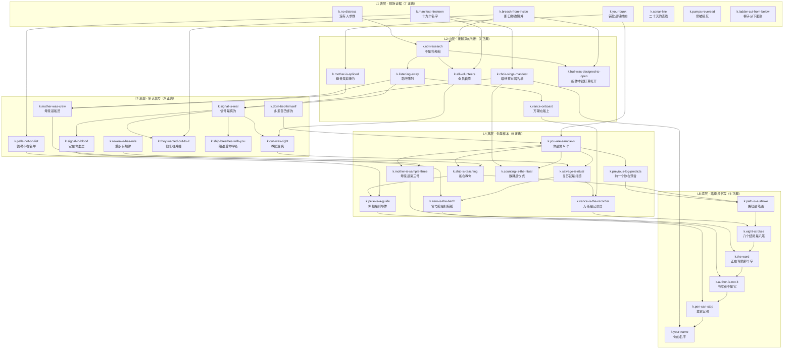

# 《铁肺迷城》叙事圣经 NARRATIVE BIBLE

> 本文件是叙事内容的**权威参考**，读者是其他产线的开发者与后续评审 Agent。
>
> 纪律：这份文档里的每一条设定都能在 `src/content/story/**` 里找到出处，凡是引用都给出**文件名与节点 id**。
> 如果你发现文档与代码不一致，**以代码为准**，然后来改这份文档。文档不负责发明设定。
>
> 配套阅读：`docs/GDD.md` §5（Veracity Layer）、§6.3（重织）、§7（叙事）。
> 统计数字来自内容校验器，可随时重新生成：
>
> ```powershell
> [Console]::OutputEncoding=[System.Text.Encoding]::UTF8; npx tsx tools/validate-content.ts   # 全量校验 + 统计
> [Console]::OutputEncoding=[System.Text.Encoding]::UTF8; npx tsx tools/validate-content.ts --flags   # 旗标读写表
> ```
>
> 校验器会把报告写到 `.validate.md`（UTF-8）。本文档所有统计对应的快照：**686 节点 / 1905 选项 / 0 error / 0 warning**。

## 目录

1. [世界观与时间线](#1-世界观与时间线)
2. [五层真相结构](#2-五层真相结构)
3. [人物档案](#3-人物档案)
4. [知识树全图](#4-知识树全图)
5. [八个结局](#5-八个结局)
6. [谎言与识破机制](#6-谎言与识破机制)
7. [旗标字典](#7-旗标字典)
8. [内容统计](#8-内容统计)
9. [附录：写作纪律与体检清单](#9-附录写作纪律与体检清单)

---

## 1. 世界观与时间线

### 1.1 三个名词

**KYRIE-9**——深潜器，属于一个叫「**静默教团**」的组织（GDD §0）。船体已断裂并卡在海沟壁上，五层甲板从 −340 m 铺到 −2,100 m（GDD §6.1）。

它对外的身份是科考船。这是假的，而且**假得很草率**：船上没有一台采样器（`k.not-research`）。它真正的结构是一支麦克风——龙骨不是承力的，是收音的（`k.listening-array`，出处 `room.sonar.array` / `vance.array`）。所有舱位都朝着同一个方向：听。

**静默教团**——不是一个有教主、有仪轨、有恐吓的邪教。它的创会记录第一条只有一句话：

> 「它不会回答。它只会听。」——`doc.founding`（logs.ts）

第二条被人用剪刀裁掉了，裁得很齐。裁下来的纸条折了三折，夹在柜子背板和铁皮之间：

> 「所以写的人是我们。」——`doc.founding.two`

这两条是整部作品的**思想核心**：教团不是被神欺骗的受害者，是**自己写命令、再执行自己写的命令**的那种组织。`doc.founding.mean` 把它说到底——「命令是人替它写的，写成祈使语气，八笔。然后人再去执行自己写的那个命令。」

**「听者」（THE LISTENER）**——`ent.listener`，登记在 `refs.ts`，设计约束是「**永不完整出现**」。叙事内容从不描写它的形状，只描写它的**语法**：断电之后才听得见的低频，八个一组，停半拍（`room.power.heard`：「它不是在说话。它在点名。」）。

关于它，内容只肯定三件事，全部可验证：

1. 它是真的。两个互不相连的系统收到同一段（`k.signal-is-real`，`choir.aligned`）；血样放到载玻片上还在按那个节拍（`k.signal-in-blood`）。
2. 它不下命令。它一次都没有要求过任何事（`k.author-is-not-it`）。
3. 它在等一个字写完。八条航迹叠起来是一个八笔的动词，祈使语气，对象不是人，意思是「**听**」（`doc.manifest.word`）。低 SAN 变体补上最后一刀：「写给它的。不是它写的。」

> **给其他产线的口径**：怪物设计、音频设计、UI 提示，一律不要给「听者」加人格、加意图、加台词。它的恐怖来源是**它什么都没做**，而船上所有人都在替它做。任何一句「它想要你」都会把 L5 拆掉。

### 1.2 时间线

以下按虚构时序排列。每一条都注明玩家从哪里挖到它。

| 时期 | 发生了什么 | 出处节点 |
|---|---|---|
| **造船期**（比破口早很多年） | 未来破口的位置，在旧漆下面刷了一行字：「此处将开。」 | `room.breach.words`（`k.hull-was-designed-to-open`） |
| 同期 | 名单板挂上舱门内侧。板后的漆和墙一样老——这块板和这条船同龄。 | `doc.manifest.taken` |
| **D+0** | 「离港。全员到齐。」十九人。 | `doc.radiolog.start` |
| **D+?** | 「深度试验完成。听得到。」——"听得到"三个字写得特别慢。 | `doc.radiolog.start` |
| **D+?** | 「听得更清楚。深度一千二。」 | `doc.radiolog.middle` |
| **D+?** | 「有人问能不能不上浮。记录在案。」记录在案四个字后面有一个勾。 | `doc.radiolog.middle`（`k.not-research`） |
| **表决日** | 「全体表决。十九票。」没有反对，也没有弃权——弃权那一栏被人用一道横线划掉了，划的人手很稳。 | `doc.radiolog.late` / `doc.radiolog.vote` |
| 同日 | 十九份手写同意书：「我自愿下潜，并自愿留下。」没有一张的字是抖的；有三张比日常签名还工整——**他们誊写过**。 | `doc.consent` / `doc.consent.steady`（`k.all-volunteers` → `k.cult-was-right`） |
| 表决后 | 记录的字迹换了人：方正，像填表。「接管记录。」这是万斯。 | `doc.radiolog.late` |
| **最后一次礼拜** | 出席十九人。记录只有一句：「今天听清楚了。散会后各自回岗。」 | `doc.service` / `doc.service.clear` |
| **最后二十天** | 无线电值班簿"内容摘要"栏每天只写一个字：位。 | `doc.radiolog` |
| 同期 | 口粮账本每天多领一份小份，记在「客」名下，二十天没断。 | `doc.galley`（`k.galley-ledger`） |
| 同期 | 泵被接反，排出口朝里；八个卡箍扭矩一致，最后一个垫了布——装的人不慌，但怕响。 | `room.pump.clamps`（`k.pumps-reversed`） |
| 同期 | 逃生管廊的梯子上半段被气割掉，溅痕从下往上。有人站在下面割掉了自己的出路。 | `room.trunk.cut`（`k.ladder-cut-from-below`） |
| 同期 | 六个人跪进礼拜堂，喉咙被平齐切开、缝口朝外，开始唱名单。 | `choir.enter` / `choir.close`（`k.choir-sings-manifest`） |
| 同期 | 大副多恩把自己绑在指挥层的椅子上。两道，交叉，结在右手边八公分，最后一下用牙咬紧。 | `dorn.knot` / `dorn.tiedSelf`（`k.dorn-tied-himself`） |
| 同期 | 船体从**里面**被撞开一米，卷边朝外。往外是水，逃不了——撞开不是为了逃，是为了离那个声音近一米。 | `room.breach.curl` / `room.breach.why`（`k.breach-from-inside` → `k.they-wanted-out-to-it`） |
| 同期 | 一条发出去的讯号，内容是坐标，重复四十次。坐标指的是月池——他们朝外面播的是自己的位置。 | `doc.radiolog.nosos` / `doc.radiolog.coord`（`k.no-distress`） |
| **最后一行** | 「位空。等下一个。」后面半行空白，钢笔尖戳了一个很深的点。 | `doc.radiolog.last` |
| **第 1–17 次打捞** | 「样本自最后所在位置回收。记录行进距离、选择序列、终止方式。」「复苏后不提示前次记录。」 | `rit.recovery`（`k.salvage-is-ritual`） |
| 其中第 3 次 | **安内莉·斯特兰**（名单第三行，职务：广播/记录，备注只有一句「声线适合」）行进完成。结案报告写「终止方式：留任」——"留任"两个字压在原来的「回收」上面，同一支笔改的。她被留下来做广播。 | `doc.personnel.three` / `doc.sample3.line` / `doc.sample3.under`（`k.mother-is-sample-three`） |
| 同上 | 报告涂黑的两行透出来：「……不得告知后续样本……」「……按其请求保留问句……」。她唯一要求保留的东西是一句话：「你吃过东西了吗。」 | `doc.sample3.redacted` / `doc.sample3.question` |
| **第 18 次 = 本轮** | 你在铺位上醒来。铺位牌上是你的名字，床单是新换的，你不记得上船。 | `pro.wake` / `pro.bunk`（`k.your-bunk`） |

**「十七」这个数字在全船出现五次，而且每次都是独立可数的物证**——这是本作最重要的一条一致性契约，任何新增内容都必须遵守：

- 第二十个打卡孔的毛刺，一层一层像年轮，**十七层**（`doc.manifest.burrs`）
- 月池那条绳子上，**十七个结**（`room.moonpool.rope`，`know.rope-knots`）
- 月池底钢板上的刻痕，**十七条线**，七种收笔，其中一种重复了十一次（`end.scene.pool` / `end.scene.pool.lines`）
- 佩勒那条管道尽头的小舱，墙上**十七道**横线，第十八道在画（`pelle.middle`）
- 人事档案钉书钉的孔位，从第十九页往后还有**一排**，间距和前面一样（`doc.personnel.mine`）

### 1.3 十九人名单

名单板挂在门内侧，铝框，玻璃碎了一角（`doc.manifest`）。十九行，手写，每行后面一个打卡孔：**十八个打透了，第十九个没打**。第二十行没有字，但有一个孔，边缘有毛刺。

| # | 名字 | 在剧中的位置 |
|---|---|---|
| 1 | 哈尔瓦·内斯 | 点名唱到的最后一个名字 |
| 2 | 比约格·利恩 | |
| **3** | **安内莉·斯特兰** | **母亲**。第三行的漆被手指磨掉了，磨在名字上不在孔上，磨了很多年 |
| 4 | 托尔莫·克瓦姆 | |
| 5 | 西格丽·奥斯 | |
| 6 | 埃利亚斯·罗特 | |
| 7 | 英格丽·福斯 | |
| 8 | 佩尔·桑德 | |
| 9 | 玛尔塔·奥伊 | |
| 10 | 约翰·布罗 | |
| 11 | 卡琳·霍尔 | |
| 12 | 斯坦·维克 | |
| 13 | 丽芙·达尔 | |
| **14** | **阿斯特丽·多恩** | 多恩的女儿。签在他前面。逃生舱第十四条安全带被放到最松，她没有来坐 |
| **15** | **埃里克·多恩** | **多恩**。签名很用力，纸背透了 |
| 16 | 露特·恩格 | |
| 17 | 亚尔·穆恩 | |
| 18 | 奥拉夫·莱恩 | |
| **19** | **万斯·基尔** | **万斯**。唯一没打过卡的孔 |
| （20） | ——（铅笔压痕，被擦过。不是名字的形状，是一个八笔的字） | 你 |

**不在名单上的两个**：佩勒（账本上的「客」）、你。

> **给世界产线的口径**：唱诗班是六具，不是十九具。剩下十三个人的下落内容**故意不交代**，只留三条痕迹：冷库第七个布袋每四秒起伏一次、缝线是从**里面**顶松的（`room.cold.*`）；礼拜堂第三具的位置是空的（`choir.body3` → `know.third-is-empty`）；医生把"听得见"当症状记录，然后建议继续暴露，他自己的病历在最下面，诊断一样（`room.sickbay.continue`）。不要补完这个缺口。

---

## 2. 五层真相结构

GDD §7.1 定义了五层。代码里它有**两套实现**，必须分清：

1. **知识树的层级**（`src/content/story/knowledge.ts` 的 `layer` 字段）。`KnowledgeTree.deepestLayer()` 只有在某一层**全部正典节点都被"理解"**（持有且全部依赖递归成立）时才推进到下一层。缺一条就停在原地。
2. **玩家自己的说法**（`prologue.ts` 的 `hub.layer1` … `hub.layer5`）。`hub.recall` 是跨轮回的"回忆中枢"，五个选项按 `count.truth-layer`（引擎从知识树投影而来）逐层解锁。**这五个节点是本章的正文**——它们是玩家在这一层真的会对自己说的话。

| 层 | 正典条数 | 解锁需要 | 玩家的原话（`hub.layer*`） |
|---|---|---|---|
| L1 表层 | 7 | — | 「船破了，人没了，你要出去。这个版本能让你活着离开。它的全部优点就是这一点。」 |
| L2 中层 | 7 | L1 全齐 | 「这条船是一支麦克风。十九个人签了字，字都不抖。他们不是被带下来的。」 |
| L3 深层 | 9 | L2 全齐 | 「声音是真的。这件事最难的部分不是害怕。是承认那十九个人是对的。」 |
| L4 真层 | 9 | L3 全齐 | 「你是第 N 个。船在重排，是为了把你已经会走的路关掉。它在教学。教得很好。」 |
| L5 底层 | 6 | L4 全齐 | 「你走的路是一笔。八种走法是八笔。合起来是一个动词，祈使语气，对象不是你。」 |

下面逐层写清：**这一层玩家相信什么 / 哪些内容节点在维持它 / 打破它需要哪几条知识**。

### L1 表层——「事故」

**玩家相信**：KYRIE-9 是科考船，出了事，人死了，我要出去。

**维持这一层的内容**：序章全部（`pro.wake` → `pro.done`），以及一切"像事故现场"的房间入口：`room.breach`、`room.pump`、`room.trunk`、`room.bunks`。万斯在这一层是纯粹的救援（`vance.hail`：「按住按钮说话」），母亲在这一层是纯粹的关心（`mother.first`：「门我关了。你吃过东西了吗。」）。

**这一层的七条正典**：`k.breach-from-inside`（卷边朝外）、`k.manifest-nineteen`（十九个名字）、`k.no-distress`（没有人求救）、`k.your-bunk`（你的铺位是铺好的）、`k.sonar-line`（二十天一条直线）、`k.pumps-reversed`（泵被接反）、`k.ladder-cut-from-below`（梯子是从下面割的）。

**打破它的机制**：这七条全是**现场证据**，`requires: []`，任何玩家第一轮都能拿到一两条。它们单独存在时都可以被"事故"解释；七条凑齐之后，"事故"这个解释需要同时承认七次巧合。L1 是本作唯一一层**不需要门控知识**就能走完的层，因此也是唯一能支撑 `end.surface` 的层。

**关键细节**：序章里「别数」这句话出现得比玩家能理解它更早。补板上刻着三个字（`pro.plate`），你自己的日志第一行也是这三个字（`self.log.first`）。这是本作最长的一条埋线，回收在 L4（`k.counting-is-the-ritual`）。

### L2 中层——「装置」

**玩家相信**：这不是事故。这是一台聆听装置，十九个人自愿开着它下来的。

**维持这一层的内容**：`room.sonar.array`（龙骨不是承力的，是收音的）、`vance.array`（万斯亲口讲解阵列，这是他给的第一份真东西）、`doc.consent`（十九张不抖的同意书）、`doc.radiolog.start/middle/late`（值班簿的时间线）。

**七条正典**：`k.not-research`、`k.listening-array`、`k.all-volunteers`、`k.vance-onboard`、`k.mother-is-spliced`、`k.choir-sings-manifest`、`k.hull-was-designed-to-open`。

**打破它需要**：L2 全部依赖 L1 的证据两两组合。`k.not-research` = 破口 + 无线电日志；`k.all-volunteers` = 名单 + 不是科考船；`k.vance-onboard` = 聆听阵列（只有用船的阵列才能报出比你自己的表还准的深度）；`k.mother-is-spliced` = 你的铺位（她只会说你听过的话）。

**这一层最难受的一条**是 `hub.layer2.sign`——玩家可以主动问自己："如果给我一张同意书，我会不会签。"回答是：

> 「你已经签了。签在你自己看不见的地方。这一点上，你和他们没有区别；有区别的是你不记得。」

### L3 深层——「声音」

**玩家相信**：声音是真的，教团没疯。

**维持这一层的内容**：`choir.melody` → `choir.aligned`（把阵列录音和唱诗班旋律对齐）、`room.power.dark/heard`（断电之后才听得见的低频，八个一组停半拍）、`doc.service.clear`（十九个人听清楚之后**还去上班了**——「这是全船最可怕的一行字」）、`rit.tide.heard`（淹没的圣堂里听水那一边）。

**九条正典**：`k.signal-is-real`、`k.cult-was-right`、`k.signal-in-blood`、`k.dorn-tied-himself`、`k.mother-was-crew`、`k.pelle-not-on-list`、`k.reweave-has-rule`、`k.they-wanted-out-to-it`、`k.ship-breathes-with-you`。

**打破它需要**：`k.signal-is-real` 是这一层的枢纽，它要求 `k.listening-array` + `k.choir-sings-manifest`——**两个互不相连的系统收到同一段**，这是内容为"不是幻听"提供的唯一证明方式。拿到它之后，L3 的其余八条会像多米诺一样倒下。

**这一层要付 SAN**。`k.cult-was-right` 的 `revealText` 就是设计意图本身：「他们是对的。这比他们疯了难接受得多。」

**`k.reweave-has-rule` 是 L3 里唯一一条与叙事无关、纯粹机制的知识**，对应 GDD §6.3「重织必须可被玩家学习」。它由 `pro.locked.rule` 唯一授予，前置是玩家在门框上划过**至少两道**记号（`count.marks >= 2`，见 `pro.threshold.mark` / `pro.marked.more` / `pro.locked.compare`）。它的内容是：划过的门都换了地方，没划过的没动，方向一样——往下。

### L4 真层——「样本」

**玩家相信**：我不是幸存者。我是第 N 个被打捞、重置、再放回去的样本。船在重组是因为它在教我。

**维持这一层的内容**：`self.*` 整条支线（第 N−1 个你的舱室与日志）、`rit.recovery`（"复苏"在他们的文件里写作"回收"）、`dorn.number` / `dorn.ropeMarks`（多恩数过你几次）、`doc.personnel.mine`（没有你那一页，但钉孔往后还有一排）、`end.scene.zero.*`（零号舱）。

**九条正典**：`k.you-are-sample-n`、`k.salvage-is-ritual`、`k.ship-is-teaching`、`k.pelle-is-a-guide`、`k.previous-log-predicts`、`k.vance-is-the-recorder`、`k.zero-is-the-berth`、`k.mother-is-sample-three`、`k.counting-is-the-ritual`。

**打破它需要跨轮回的物证**。`k.previous-log-predicts`（前一个你在预言）只能在 `self.log.*` 拿到，而它的实现不是"写几句像预言的台词"，是**机制化的**：`ledger.ts` 的 `DEEDS` / `BELIEFS` 两册账本把你这一轮做过的每一件 `did.*` / `know.*`，以你自己的字迹写在他的本子上（见 §7）。

**这一层的成绩单**是 `hub.layer4.grade`：「你这次比上次快。你这次没有回头。你这次记得数。很好。这是个很坏的消息。」

**「别数」在这一层反转**。`k.counting-is-the-ritual`：「"不要数"不是禁令，是分工。他们不数了，所以需要一个人替他们数。」照片背面写着**谢谢**（`room.bunks.photo` → `room.bunks.counting`，`know.photo-thanks`）。

### L5 底层——「笔画」

**玩家相信**：迷宫不是给我走的。我走过的路径本身就是在书写。八个结局是八个笔画。

**维持这一层的内容**：`end.scene.pool`（池底十七条线）、`pelle.chartBack` → `pelle.overlay`（把八条航迹叠起来）、`self.stroke` → `self.compared`（「他走的是第七种。你走的是第八种。」）、`vance.columns` → `vance.logbook.read`（八栏，七个勾）、`end.scene.zero.desk`（记录台上的表，第八栏表头是空的，钢笔搁在上面，笔尖朝着你）。

**六条正典（依赖是一条链，不是网）**：

```
k.path-is-a-stroke  →  k.eight-strokes  →  k.the-word  →  k.author-is-not-it  →  k.pen-can-stop  →  k.your-name
```

**打破它需要**：全部 L4。而 `k.the-word` 还额外要求 `k.zero-is-the-berth`——你必须站在零号舱里才能把八条航迹叠在一起。

**这一层的三次转折**，按顺序：

1. `k.the-word`——八笔合起来是一个动词，祈使语气，**对象不是人**。意思是「听」。
2. `k.author-is-not-it`（`doc.founding.two` / `self.whoWrote`）——「它一直只是在听。是我们在写。」`self.broke` 把这句话做成了道具：笔折断了，断口里没有墨，笔里面一直是空的。「所以写字的不是笔，也不是它——是那只手愿意动。」
3. `k.pen-can-stop`——「样本不能拒绝走。但可以拒绝走到底。差一笔的字不成字。」它的权威来源不是顿悟，是**规程**：仪式手册第三部分只有一句「若样本拒绝终止，暂停回收，等待」（`rit.partThree` → `rit.allowed`：「规程里写着这一条，说明有人试过。试过的人不在名单上，因为名单是给走完的人写的。」）

**最后一条 `k.your-name`** 收在半拍上：点名唱到第二十行时停半拍，那半拍是留给你答应的。低 SAN 变体：「那半拍是留给你的。你上次填了。」

> **`hub.recall.layer5` 是全作唯一一个 `gateMode: 'lie'` 的回忆选项**。玩家在 L5 未成立时点它，系统不拦，而是让他张嘴——然后 `lie.hub.recall.layer5`：「你说出来的是上一层。最下面那一层你还没有资格知道，所以你的嘴替你改了口。」这是把"不许偷看"写成了生理现象。

---

## 3. 人物档案

六个 NPC 全部不可完全信任（GDD §7.2）。四角对立的分工是明确的：

| 角 | 谁 | 攻击玩家弱点的方式 |
|---|---|---|
| 主要对手 | 万斯 | **给答案**（玩家的弱点是想知道） |
| 第二角 | 母亲 | **给被爱的感觉** |
| 第三角 | 唱诗班 | **给一个位置**（名单第二十行） |
| 第四角 | 佩勒 | **给陪伴**（一个还在玩的游戏） |
| 盟友 | 多恩 | 当面说出玩家的道德弱点 |
| 镜像 | 你自己 | 证明这一切已经发生过十七次 |

### 3.1 万斯 VANCE — `src/content/story/npc-vance.ts`（74 节点 / 138 选项 / 3 入口）

- **身份**：无线电里的声音，自称救援。名单第十九行，万斯·基尔，唯一没打过卡的那个孔。
- **核心张力**（GDD §7.2）：他给的坐标越来越准——因为他在船上。
- **剧作位置**：Truby 步骤 8 的**假盟友对手**。他从不威胁玩家。他要的回报只有一样：**让你描述你看到的东西。他从不描述他看到的。**
- **口头禅**：「按住按钮说话。」结尾反用——最后一次是他求你按住（`vance.final`）。
- **他一直在预告而永远不发生的事**：上浮窗口。窗口永远差二十分钟（`vance.window` / `vance.window.again` / `vance.window.waited`）。
- **入口**：`vance.hail`（首次呼叫，`met.vance`）、`vance.channel`（常驻频道，本作最大的对话枢纽）、`vance.final`（收束）。

**他的三个谎言（`gateMode: 'lie'`）**

| 门控 | 谎言落点 | 他揭穿的是玩家 |
|---|---|---|
| `vance.columns/vance.columns.ask8` | `lie.vance.columns.ask8` | 「你刚才说的不是"哪八栏"。你说的是"第几栏是我"。」 |
| `vance.channel/vance.channel.logbook` | `lie.vance.channel.logbook` | 「我这边没有值班簿。」——翻纸的声音持续了两秒才停 |
| `vance.logbook.read/vance.logbook.read.eighth` | `lie.vance.logbook.read.eighth` | 「表头那格是空的，空的念不出来。你念给我听。」 |

**他给的知识**：`k.listening-array`（`vance.array`）、`k.vance-onboard`（`vance.chair.knows` / `vance.verify.conclude` / `vance.where.again`）、`k.vance-is-the-recorder`（`vance.channel.recorder` / `vance.designer` / `vance.recorder`）、`k.eight-strokes`（`vance.columns.eight` / `vance.logbook.read`）。

**他的分支走向**（三条，互斥于最后一次通话）

1. **按住**（`vance.final.hold` → `vance.final.held`）：「谢谢。第八栏的表头我填了。填的是你的名字。」玩家若持有 `k.pen-can-stop`，可以说「擦掉」→ `vance.final.erase`：「我擦不掉。我只有笔。**你有别的东西。**」——这是通往 `end.author` 的最重要一次授权。
2. **松手**（`vance.final.release` → `vance.final.released`）：载波断在一个字的中间，那个字的前半是"别"。若玩家已知 `know.dont-count`，可以补上后半 → `vance.final.dont`：「别数。和补板上一样。**所以那三个字不是他刻的——他只会说。**」
3. **中途关掉他**（`vance.recorder.stop` → `vance.stopped` / `vance.off` / `vance.removed`）：序章就给了这条路（`pro.muted`：红灯灭了，舱里剩下你的呼吸，只有你的，「这是今天第一件确定的事」，SAN +4）。

**他最关键的一句自我定义**（`vance.recorder`）：「不是。我是来记录你怎么救自己的。这两件事看上去很像。」以及 `vance.designer`：「没有设计者。有一份会议记录，十九个人举手。我是做记录的那个。」

### 3.2 母亲 MOTHER — `src/content/story/npc-mother.ts`（53 节点 / 100 选项 / 3 入口）

- **身份**：潜艇广播。声音是你母亲的。真身是名单第三行**安内莉·斯特兰**，职务"广播/记录"，备注一句「声线适合」——适合什么没有写。
- **核心张力**：它是被录下来的，还是被做出来的。答案是第三种：她是第三号样本，走完了，然后被留下来值班（`k.mother-is-sample-three`）。
- **"声线适合"的意思**是**适合被剪**（`doc.personnel.for`）：「她的每句话都是家常话，家常话可以拆成词，词可以重排。」每句话中间有一下"咔"（`k.mother-is-spliced`）。
- **技术真相**：广播的信号不是从舱内发出的，是从舷外接进来再放大。放大器上贴着一张手写标签：「转接：母」（`room.sonar.source`）。磁带只是备份，原件在别的地方，**而且它在学**（`mother.notTape`）。
- **口头禅**：「你吃过东西了吗。」她从不说"我爱你"，她说「灯我留着」。
- **入口**：`mother.first`（`met.mother`）、`mother.pa`（常驻广播枢纽）、`mother.last`（收束）。

**她唯一的谎言（`lie.mother.pa.door`）**：「（咔）门我关了。」——而走廊那头的门还是开着的，**你能看见它开着**。这是全作**最干净的一次"可被识破"**：破绽不在系统里，在玩家的眼睛里。识破后写 `know.door-claim-false` + `count.caught-mother`。

**她给的知识**：`k.mother-is-spliced`（`mother.repeat.click` / `mother.spliced` / `mother.tape.slow`）、`k.mother-was-crew`（`mother.thirdrow`）、`k.mother-is-sample-three`（`mother.finished` / `mother.meaning`）、`k.vance-onboard`（`mother.tape.vance`）、`k.pelle-whistle-origin`（`mother.pelle.number`）。

**她的分支走向**（三条）

1. **接受她的照顾**：`mother.fed` / `mother.bowl` / `mother.promise`（「这次我回来关」灯）。代价是 `listening`。食堂第二张桌子那副空碗筷是真的在用，痕很旧（`doc.galley.table`）；坐下之后广播会问那一句（`doc.galley.sat`）。
2. **拒绝她**：`mother.stopwaiting`（「别留了」）/ `mother.lightsoff` / `mother.dark`。
3. **让她对着自己说那句话**：`mother.last`——「（咔）**我**吃过东西了吗。」玩家可以回答（`mother.last.answered`：「好。碗放着，我收。」）或者不回答（`mother.last.silent`：只剩一个"咔"）。这是全作最短、也是唯一一次她**把问句指向自己**。

**设计口径**：她的每一句要紧话都会被一下剪接的"咔"压下去（契诃夫 D1）。全剧她最长的一句话是关于门闩的，最短的一句是「走完了」（`mother.finished`）。不要给她写抒情台词。

### 3.3 多恩 DORN — `src/content/story/npc-dorn.ts`（66 节点 / 124 选项 / 2 入口）

- **身份**：大副，埃里克·多恩，名单第十五行。活着。被绑在指挥层的椅子上。
- **核心张力**：是他绑的自己，还是别人绑的。答案：绳结在他手能到的地方，收尾的结是用**牙**咬紧的（`k.dorn-tied-himself`，`dorn.knot` / `dorn.teeth`）。
- **他不说的话**：名单第十四行姓多恩，是他女儿阿斯特丽。她签在他前面（`dorn.fourteen2`）。他从不提她，只问水位。
- **口头禅**：「别解。」他从不解释为什么。他要求玩家做的事全是家务：报水位、把帽子捡起来、把窗关上。
- **剧作位置**：全剧唯一的盟友，也是执行 Truby 步骤 13「盟友的攻击」的人（`dorn.attack`）：「你不是想解开我。你是想问我。」他把自己和玩家并列为同一种失败——「你和我一样，都想知道。区别是我坐下来了。」
- **入口**：`dorn.first`（`met.dorn`）、`dorn.chair`（常驻枢纽）。

**他的三个谎言**

| 门控 | 落点 | 内容 |
|---|---|---|
| `dorn.teeth/dorn.teeth.mine` | `lie.dorn.teeth.mine` | 「不是你的。你的牙比这个整。你还年轻。**这次。**」 |
| `dorn.chair/dorn.chair.kill` | `lie.dorn.chair.kill` | 「你下不了手，因为你还想让我说下去。报水位。」 |
| `dorn.whichChair/dorn.whichChair.name` | `lie.dorn.whichChair.name` | 「那不是名字。那是编号。编号我记得。名字我不记得了，对不起。」 |

**他给的知识**：`k.dorn-tied-himself`、`k.you-are-sample-n`（`dorn.number` / `dorn.ropeMarks` —— 他数过你几次）、`k.ship-is-teaching`（`dorn.bothMe`，**全作唯一授予者**）、`k.previous-log-predicts`（`dorn.tiedSelf`）、`k.dorn-daughter`（`dorn.fourteen2`）。

**他的分支走向**（四条，其中两条不可逆）

1. **听他的，别解**（`dorn.silence`：「好。那就别解。」→ `dorn.fate`：「水位。我在这儿报。」）——他留在椅子上。
2. **解开他**（`dorn.untied` → `dorn.doorClosed` → `dorn.retieSelf` / `dorn.stayed`）：他会**自己重新绑回去**（`dorn.retied`）。
3. **杀了他**（`dorn.cut` / `dorn.knife` → `dorn.killed`）：「很快。他没有挣，也没有看你。最后那口气是往里吸的，不是往外呼的。」
4. **坐上那把椅子**（`dorn.sat` → `dorn.tiedSelf` → `dorn.waited` → `dorn.becameDorn`）——**本作最好的一段戏**：你两道交叉绑好自己，最后一下用了牙，「你不记得自己学过」；然后门口来了一个人，停了一下，问了水位；你报了，**报得很准**。这是全作唯一一次让玩家亲手演出"轮回"的场面，而且不需要一句解释。

### 3.4 唱诗班 THE CHOIR — `src/content/story/npc-choir.ts`（54 节点 / 109 选项 / 2 入口）

- **身份**：六具还在唱歌的尸体，跪成一排，面朝下坡的那一边。喉咙都被平齐切开、**缝口朝外**——声音不走喉咙，走骨头（`know.bone-conduction`）。
- **核心张力**：他们唱的是你的名字。
- **结构**：整场戏的骨架是**点名**，从第一到第十九，然后回到第一。所有重要的事都发生在两个名字之间。第二十行有半拍的空，那半拍是留给回答的人的。
- **他们从不说话，只唱。回答问题的方式是唱下一个名字。**
- **入口**：`choir.enter`（`met.choir`）、`choir.pews`（走进跪排之间检查六具）。

**两个谎言**

- `choir.close/choir.close.touch` → `lie.choir.close.touch`：你在没有数过之前去摸自己的喉咙。摸到一道横的——那是面罩密封圈压的印。低 SAN 变体拆掉这个安慰：「你今天还没戴过面罩。」
- `choir.twenty/choir.twenty.hers` → `lie.choir.twenty.hers`：你在那半拍里填了**别人的名字**。六个人一起停了，停的时间比半拍长，然后从"第一"开始重唱。**你欠了一整轮。**

**他们给的知识**：`k.choir-sings-manifest`（`choir.answered` / `choir.refused` / `choir.falseName` / `choir.fullRound`）、`k.signal-is-real`（`choir.melody.match` / `choir.aligned`）、`k.signal-in-blood`（`choir.ownNeck`）、`k.your-name`（`choir.pews.name` / `choir.myName`，**主要授予者**）、`k.vance-onboard`（`choir.vanceSung`）、`k.dorn-daughter`（`choir.fourteen.note`）、`k.path-is-a-stroke`（`choir.impression`）。

**他们的分支走向**（四条）

1. **听完一整轮**（`choir.first-names` → `choir.nine` → `choir.fourteen` → `choir.nineteen` → `choir.twenty` → `choir.fullRound`）——纯信息路径，代价是 `count.choir-time` 与 `listening`。
2. **填上第二十行**（`choir.myName.fill` → `choir.filled`：「合唱现在多了一个声音，而你的嘴不需要动了。」）→ 跪下（`choir.kneeled`：膝盖落在第三具的跪印里，跪印是温的）→ 不站起来（`choir.stayed`：「第七具的跪印是你压出来的。再过一会儿，会有人进来数声音，数出七个。」）。这条路写 `ritual.name` + `ritual.count`，通向 `end.congregation`。
3. **留着那半拍**（`choir.myName.leave`）——`silence` 路线。
4. **打断合唱**（`choir.interrupted` → `enc.choir-rise`）或**塞住耳朵**（`choir.plugged` → `choir.deafRest`：「八个呼吸的安静。这是今天最安静的八个呼吸。第九个呼吸的时候，蜡里面传来了那个拍子。」）

**第五具的信**（`choir.body5` → `choir.letter` → `choir.signature`）：整封信只有一句——「我听见了，很好听，别来。」签名被水泡开了。低 SAN 变体：**字迹是你的。**

### 3.5 佩勒 PELLE — `src/content/story/npc-pelle.ts`（57 节点 / 108 选项 / 2 入口）

- **身份**：管道里一个小孩的声音。船员名单上没有小孩。他是口粮账本上的「客」——每天一份小份，二十天没断（`k.galley-ledger` → `k.pelle-not-on-list`）。
- **核心张力**：名单上没有小孩。
- **L4 真相**：训练动物走迷宫时，会先放一只已经会走的进去。**他是先放进去的那只**（`k.pelle-is-a-guide`）。
- **他的破绽**：他知道所有舱室的名字，但**顺序是反的**——他是从图纸上学的，没有走过（`pelle.reversed`，前置是与他对过三次舱室名，`count.rooms-named`）。
- **他不说的话**：他为什么从来不出来。答案在 `pelle.middle`：管道中间那支通到一个很小的舱，里面有一张儿童尺寸的床垫，**凉的，上面没有凹，一点都没有**（`pelle.mattress`）——没有人在这上面睡过，所以他一直没有躺下。墙上有十七道横线，第十八道在画。
- **他的哨子**是救生衣配件，编号 **03**——第三号样本的那件（`k.pelle-whistle-origin`）。`pelle.whistleWhere`：「我放的。放的时候她还在唱。」
- **口头禅**：「这里有回声。」
- **入口**：`pelle.first`（`met.pelle`）、`pelle.pipe`（常驻枢纽）。

**两个谎言**

- `pelle.blueprint/pelle.blueprint.ask` → `lie.pelle.blueprint.ask`：「我没有说图纸。是你说的。」低 SAN 变体：「他没有说过图纸。**这次**没有。」
- `pelle.pipe/pelle.pipe.zero` → `lie.pelle.pipe.zero`：「零号我不去。你也还不能去。你少一样东西，你自己知道少哪一样。」

**他给的知识**：`k.pelle-not-on-list`（`pelle.reversed` / `pelle.notOnList`）、`k.pelle-is-a-guide`（`pelle.guide`：「嗯。我先进来，你们跟着。」）、`k.you-are-sample-n`（`pelle.tally`）、`k.path-is-a-stroke`（`pelle.chartBack`）、`k.the-word`（`pelle.overlay`——把八条航迹叠在一起）、`k.pen-can-stop`（`pelle.penStops`）。

**他的分支走向**（三条）

1. **陪他玩**（`pelle.game` / `pelle.nine` / `pelle.notNine`；`count.pelle-games`）。**他数到八就不数了**，`pelle.eight` 给出全作最重的一句话，用一个小孩玩游戏的口气说出来：「因为画到一半的画不算画。**你数到十，我数到八。这样就一直有人玩。**」
2. **逼他**（`pelle.gotOut.press` / `pelle.age.press` / `pelle.tired.press`；`count.pressed-pelle`）→ `pelle.tired2`：「你数到十的时候，我就可以歇一下。」玩家可以数（`pelle.rested`）或者不数（`pelle.notRested`）。
3. **爬进管道**（`pelle.crawl` → `pelle.deep` → `pelle.middle` / `pelle.debunkedPipe`）。`pelle.deep` 是全作最好的一次识破机会：三支管道都有回声，中间那支的延迟**比管长允许的更长**；持有 `k.reweave-has-rule` 就能说出「延迟不对。中间那支是幻觉。」（SAN +10）。

**他的收束**：`pelle.penStops`——「对。**可是你每次都画完。**」玩家可以承诺这次不画完（`pelle.promised`），或者在 `pelle.stoppedCounting` 里让他说出全作最像人的一句话：「没有人跟我这么说过。」

### 3.6 你自己 YOURSELF — `src/content/story/npc-yourself.ts`（52 节点 / 99 选项 / 2 入口）+ `ledger.ts`（51 节点 / 694 选项 / 4 入口）

- **身份**：第 N−1 个你。门牌上是你的名字，里面有一个人坐在铺沿上向前倾，穿的衣服和你身上这件一样（`self.enter`）。低 SAN 变体：**里面没有人。铺沿上有一个人形的凹，还热着。**
- **核心张力**：他留下的日志在预言你的行动。
- **实现方式不是台词，是机制**。`ledger.ts` 的两册账本（`DEEDS` 260 行 / `BELIEFS` 256 行）逐条读取 `did.*` / `know.*`。你这一轮做过的**每一件事**，都已经以你的字迹写在他的本子上。你做得越多，他的本子越厚。读一行付一口呼吸。
- **批注系统**：每一行按语气（`obey` 顺从 / `refuse` 拒绝 / `cruel` 狠 / `kind` 软 / `curious` 好奇 / `count` 数）落到 `self.margin.*` 六个批注节点之一。**只有六种，因为他见过的样本只有六种走法。**
- **入口**：`self.enter`、`self.room`、`ledger.open`、`ledger.counts.p1` / `ledger.deeds.p1` / `ledger.beliefs.p1`。

**他唯一的谎言（`lie.self.log.index.count`）**：你去数写满的行数——「数到第九行的时候，第九行写的是"数到第九行"。你的手停了。」低 SAN 变体：「停也写在第十行。」这是全作唯一一个**递归**谎言，也是"别数"这条禁令唯一一次直接反噬。

**他给的知识**：`k.previous-log-predicts`（`self.log.date` / `self.log.index` / `self.lineCount` / `self.wrote` / `self.newLine`）、`k.you-are-sample-n`（`self.under` / `self.myNails` / `self.hisPlate`）、`k.signal-in-blood`（`self.neck`）、`k.path-is-a-stroke`（`self.erasure` / `self.tore` / `self.stroke`）、`k.eight-strokes`（`self.compared`）、`k.author-is-not-it`（`self.broke` / `self.whoWrote`）。

**他的三件道具**（契诃夫 C4，全部回收）

1. **笔**（`self.pen`）。永远是温的。结尾在你手里（`end.scene.zero.pen`：「握的位置正好落在你食指那道压痕上」）。折断它（`self.broke`）会发现里面一直是空的。
2. **镜子**（`self.mirror`，`know.mirror-shows-two`）。识破需要 `count.debunks >= 2`——**全作唯一一条用"识破经验"本身做门控的选项**（`self.mirror.debunk` → `self.mirrorDebunk`）。
3. **日志第一行**（`self.log.first`）：「不要数。」第二行是今天的日期。

**他的收束**：`self.compared`——「他走的是第七种。你走的是第八种。八种凑齐了就是一个字。」

---

## 4. 知识树全图

数据在 `src/content/story/knowledge.ts`，逻辑在 `src/narrative/knowledge.ts`。

- **41 条**：正典 38 + 非正典 3（`apocrypha: true`，有趣但 `end.author` 不要求）。
- **依赖语义**：持有但依赖不全 = **碎片**（`fragments()`），UI 上显示为残句，**不计入真相层深度**。
- **层级校验（E11）**：不许依赖更深层的节点，不许成环，正典不许依赖非正典，每条必须有内容授予它。当前全部通过。
- **`cyclesWitnessed()`**：统计"首次获得某知识"发生在多少个不同轮回里。`end.author` 要求 ≥ 4，这保证真结局**不可能单轮速通**。

### 4.1 依赖图



**非正典三条（不进上图，`end.author` 不要求）**

| id | 层 | 依赖 | 由谁授予 | 内容 |
|---|---|---|---|---|
| `k.galley-ledger` | L1 | — | `doc.galley` | 最后二十天每天多领一份，记在「客」名下 |
| `k.dorn-daughter` | L2 | `k.manifest-nineteen` | `dorn.fourteen2` / `choir.fourteen.note` / `doc.manifest.dorns` / `end.scene.exit.belt` | 名单第十四行是他女儿 |
| `k.pelle-whistle-origin` | L3 | `k.pelle-not-on-list` | `mother.pelle.number` / `choir.whistle` | 哨子编号 03，第三号样本的救生衣 |

### 4.2 授予者与消费者对照表

「授予」= 有 `learn()` 效果的节点数；「被门控读取」= 有多少个选项用 `has-knowledge` 读它。**这一列是"这条知识买到了什么"的唯一度量。**

| 知识 | 层 | 授予处数 | 被门控读取 | 代表性消费点 |
|---|---|---|---|---|
| `k.breach-from-inside` | 1 | 3 | 0 | —（只做依赖） |
| `k.manifest-nineteen` | 1 | 2 | 4 | `vance.list.twenty` / `pelle.pipe.notlist` |
| `k.no-distress` | 1 | 2 | 0 | —（只做依赖） |
| `k.your-bunk` | 1 | 3 | 3 | `doc.radiolog.last.next`（"下一个"是我） |
| `k.sonar-line` | 1 | 2 | 1 | `room.sonar.array` |
| `k.pumps-reversed` | 1 | 2 | 0 | —（只做依赖） |
| `k.ladder-cut-from-below` | 1 | 2 | 0 | —（只做依赖） |
| `k.not-research` | 2 | 3 | 2 | `vance.channel.array` |
| `k.listening-array` | 2 | 6 | 4 | `vance.sync.debunk` / `choir.sixVoices.debunk`（两次识破） |
| `k.all-volunteers` | 2 | 6 | 3 | `doc.archive.service` / `hub.layer2.sign` |
| `k.vance-onboard` | 2 | 8 | 2 | `vance.channel.recorder` |
| `k.mother-is-spliced` | 2 | 8 | 5 | `mother.mom3.splice`（识破） |
| `k.choir-sings-manifest` | 2 | 5 | 1 | `vance.choir.names` |
| `k.hull-was-designed-to-open` | 2 | 2 | 0 | —（只做依赖） |
| `k.signal-is-real` | 3 | 13 | 2 | `doc.service.what` / `room.breach.curl.why` |
| `k.cult-was-right` | 3 | 8 | 2 | `doc.archive.founding`（开创会记录） |
| `k.signal-in-blood` | 3 | 4 | 1 | `rit.relic.open.eat` |
| `k.dorn-tied-himself` | 3 | 6 | 1 | `dorn.chair.count` |
| `k.mother-was-crew` | 3 | 5 | 3 | `doc.archive.sample3`（开第三号报告） |
| `k.pelle-not-on-list` | 3 | 4 | 2 | `pelle.pipe.guide` |
| `k.reweave-has-rule` | 3 | **1** | 1 | `pelle.deep.debunk`（识破幻觉管道） |
| `k.they-wanted-out-to-it` | 3 | 3 | 0 | —（只做依赖） |
| `k.ship-breathes-with-you` | 3 | 3 | 0 | —（只做依赖） |
| `k.you-are-sample-n` | 4 | **20** | 2 | `vance.lasttime.push` / `mother.howlong.same` |
| `k.salvage-is-ritual` | 4 | 4 | 4 | `rit.manual.three` / `dorn.teaching.fail` |
| `k.ship-is-teaching` | 4 | **1** | 4 | `hub.layer4.grade` / `self.room.stroke` |
| `k.pelle-is-a-guide` | 4 | 3 | 2 | `pelle.eight.understand` |
| `k.previous-log-predicts` | 4 | 8 | 1 | `self.room.stroke` |
| `k.vance-is-the-recorder` | 4 | 5 | 4 | `vance.window.again.press` / `rit.relic.chorus.writer` |
| `k.zero-is-the-berth` | 4 | 2 | 1 | `pelle.pipe.zero` |
| `k.mother-is-sample-three` | 4 | 6 | 2 | `choir.twenty.hers` |
| `k.counting-is-the-ritual` | 4 | 2 | 0 | —（只做依赖） |
| `k.path-is-a-stroke` | 5 | 8 | 1 | `vance.columns.ask8` |
| `k.eight-strokes` | 5 | 10 | 4 | `doc.manifest.twenty.read`（认那个字） |
| `k.the-word` | 5 | 4 | 4 | `room.moonpool.speak` / `doc.founding.mean` |
| `k.author-is-not-it` | 5 | 8 | 1 | `pelle.eight.understand` |
| `k.pen-can-stop` | 5 | 8 | **6** | `hub.layer5.stop` / `end.scene.pool.lines.eighth` |
| `k.your-name` | 5 | 4 | 0 | —（`end.scene.pool.stopped` 授予，是终点） |

> **已知设计缺口（11 条知识"被授予但从不被任何选项读取"）**：`k.breach-from-inside`、`k.no-distress`、`k.pumps-reversed`、`k.ladder-cut-from-below`、`k.hull-was-designed-to-open`、`k.they-wanted-out-to-it`、`k.ship-breathes-with-you`、`k.counting-is-the-ritual`、`k.your-name`、`k.galley-ledger`、`k.pelle-whistle-origin`。
>
> 它们不是 bug——每一条都在知识树里承担依赖，并计入真相层推进，所以校验器不报错。但从**玩家体验**看，它们只在"你知道的事"列表里加了一行，没有任何一句台词因为它而解锁。其中最可惜的是 `k.counting-is-the-ritual`（"别数"这条全作最长埋线的收束）和 `k.they-wanted-out-to-it`（"不是为了逃，是为了近一米"）。建议后续每条至少接一个 `has-knowledge` 门控的选项。详见 §9。

---

## 5. 八个结局

定义在 `src/content/story/endings.ts` 的 `ENDINGS`；落幕场景在同文件的 `ENDING_NODES`。

**两个跨越所有结局的机制约定**

1. **落幕一律用 `finish()` 直接定音**，不依赖 `resolveEnding()` 的优先级。`priority` 只用于"死亡/超时"等非内容路径的兜底判定与冲突诊断（`NarrativeEngine.endingVerdict()`，多个条件同时成立时会把冲突写进 `sys.ending.conflicts`）。
2. **逃生舱的释放杆做了硬门控**：只有当这一次的"笔画"已经收得完整（对应 surface / silence / apostate 三种收笔方式）时才拉得动。拉不动的那次不是 bug，是主题——差一笔的字不成字，所以船不放你走。硬拉会落到 `lie.end.scene.exit.force`：「杆动了两指，停住。不是机构卡住。是它下面还连着一根线，线的另一头在你身上。」

### 5.1 总表

| # | id | 名称 | rank | pri | 触发条件（`requires`） | 真相层 | 元进度解锁 |
|---|---|---|---|---|---|---|---|
| 1 | `end.surface` | 浮出水面 | good | 20 | `did.escaped` ∧ SAN > 50 ∧ `ritual.count == 0` | **L1** | `meta.first-exit` |
| 2 | `end.silence` | 缄默 | bittersweet | 50 | `did.escaped` ∧ `did.welded-moonpool` ∧ silence ≥ 6 ∧ listening/drowned/iron ≤ 2 | **L3** | `meta.weld` |
| 3 | `end.apostate` | 叛教者 | good | 60 | `did.escaped` ∧ `did.destroyed-relic` | **L3** | `meta.apostasy` |
| 4 | `end.congregation` | 入会 | bad | 70 | `ritual.count ≥ 3` ∧ listening ≥ 5 | **L3** | `meta.hymn` |
| 5 | `end.iron` | 铁肺 | bittersweet | 78 | `did.became-iron-lung` | **L3** | `meta.trunk-plug` |
| 6 | `end.drowned` | 溺者 | bad | 80 | `did.drowned-self` | **L2–L3** | —— |
| 7 | `end.zero` | 零号 | secret | 90 | `did.entered-zero` ∧ `count.truth-layer ≥ 4` | **L4** | `meta.zero-berth` |
| 8 | `end.author` | 书写者 | true | 100 | `did.final-choice-at-pool` ∧ `count.truth-layer ≥ 5` ∧ `count.cycles-witnessed ≥ 4` | **L5** | `meta.pen` + `meta.eighth-column` |

> `end.silence` 的 GDD 条件是「stigma.silence **最高**」。Condition DSL 表达不了"互相比较"，因此拆成 `silence ≥ 6` 且 `listening/drowned/iron ≤ 2`，语义等价于"沉默是主导圣痕"。这是内容侧对 GDD 的一次**显式**降级，已在 `endings.ts` 文件头注明。

### 5.2 逐个结局：路径与主题

**校验器证明的路径**是从任意 entry 出发的最短接近段（因为所有枢纽节点都是 `entry`，世界层可随时 `start()`）。下面同时给出**玩家实际会走的完整因果链**。

#### ① `end.surface` 浮出水面（good / L1）

- **校验路径**：`end.scene.exit` → `end.scene.exit.pod` → `end.scene.surface` → `finish`
- **完整链**：序章 → 任意房间攒 L1 证据 → **不做任何仪式** → `room.trunk.hatch` 找到逃生舱 → `end.scene.exit` → `end.scene.exit.sit` → `end.scene.exit.pod` → `end.scene.exit.go.surface`（门控 `SAN>50 ∧ ritual.count==0 ∧ ¬did.destroyed-relic`）→ `end.scene.surface` → `end.scene.surface.up`
- **主题**：这是唯一一个**用无知换来的好结局**，副标题就是「你什么都没做完」。落幕最后一句是全作最冷的一处克制：「救援船上的人问你船上有多少人。你说十九。你没有说第二十行的事。」
- **纪律**：这条路必须永远走得通。它是 GDD「玩家可能只挖到第 1 层就通关」的兑现，也是第一轮玩家最可能拿到的结局。任何新增的强制仪式内容都不许污染 `ritual.count`。

#### ② `end.silence` 缄默（bittersweet / L3）

- **校验路径**：`end.scene.exit` → `end.scene.exit.pod` → `end.scene.silence` → `finish`
- **完整链**：`end.scene.weld`（月池边的补板）→ `end.scene.weld.plate`（漆下三个字：不要数）→ `end.scene.weld.do`（需要 `welder`；`silence +5`，`apostasy +1`，噪音 34）→ `end.scene.weld.done`（`silence +2`，水面第一次低于两指）→ `end.scene.weld.done.go` → `end.scene.exit` → `end.scene.exit.pod` → `end.scene.exit.go.silence`（门控 `did.welded-moonpool ∧ silence ≥ 6`）→ `end.scene.silence` → `end.scene.silence.up`
- **主题**：你承认了声音是真的，所以你去把那个口子封上，然后**再也不说话**。这是唯一一个把"沉默"从生存技巧升级为伦理立场的结局：「你永远不会告诉任何人下面有什么。这是你为它做的最后一件事。」
- **注意**：`listening/drowned/iron ≤ 2` 的上界要求意味着这条路**必须整轮保持克制**。这也是 E08 校验器必须支持"否定型条件"的原因，见 §9。

#### ③ `end.apostate` 叛教者（good / L3）

- **校验路径**：`end.scene.exit` → `end.scene.exit.pod` → `end.scene.apostate` → `finish`
- **完整链**：`rit.relic.room`（圣物室，仪式锁）→ `rit.relic.grooves` / `rit.relic.score` → `rit.relic.open` → `rit.relic.destroyed`（`did.destroyed-relic`，`apostasy +4`，噪音 28）→ 可选 `rit.relic.silence`（听那三秒）→ `end.scene.exit.pod` → `end.scene.exit.go.apostate` → `end.scene.apostate`
- **主题**：唯一一个"你赢了"的结局，而且赢法是**破坏**。落幕点出代价：「整条船安静了大约四秒。四秒之后，每一个你走过的舱室都开始找你。」以及最后一击：「它们的名单上少了一笔，这件事会被记录，然后被重新安排。」
- **最好的一段写作**在 `rit.relic.destroyed`：「毁掉一块肉不难。难的是毁完以后那三秒。那三秒里没有任何声音，包括你自己的呼吸。」

#### ④ `end.congregation` 入会（bad / L3）

- **校验路径**：`end.scene.congregation` → `end.scene.congregation.seat` → `finish`
- **完整链**：`rit.altar`（祭坛玻璃下三行：潮、名、息）→ 三个仪式各自做完：
  - **潮** `rit.tide.edge` → `rit.tide.chest` → `rit.tide.chin.breathe` → `rit.tide.done`（`ritual.tide`，`drowned`）
  - **名** `choir.myName.fill` → `choir.filled.kneel` → `choir.kneeled`（`ritual.name`，`listening +2`）
  - **息** `rit.breath.trunk` → `rit.breath.port` → `rit.breath.connected.accept`（`ritual.breath`，`iron`）
  - → `rit.three`（三样都做完）→ `end.scene.congregation` → `end.scene.congregation.kneel`（门控 `ritual.count ≥ 3 ∧ listening ≥ 5`）→ `end.scene.congregation.seat`
- **另一条入口**：`end.scene.congregation.stand` → `end.scene.congregation.stood` → `end.scene.congregation.stood.answer`（在半拍里说出自己的名字）→ 同一个落幕节点。
- **主题**：副标题引用礼拜记录的原话——「散会后各自回岗。」这个结局的可怕之处不是加入，是**加入之后照常上班**：「唱到第十九，又回到第一。这件事不需要结束，所以它不结束。」

#### ⑤ `end.iron` 铁肺（bittersweet / L3）

- **校验路径**（全作最长，7 跳）：`rit.breath.trunk` → `rit.breath.port` → `rit.breath.connected` → `rit.breath.done` → `rit.breath.merged` → `rit.breath.iron` → `end.scene.iron` → `finish`
- **主题**：把呼吸——本作唯一的货币——永久外包。「你不再需要数呼吸，因为呼吸不再是你的事。」`rit.breath.done`：「跟上以后就不用想了。船的应力声和你的呼吸变成同一件事。」落幕把它和母亲接上：「十九个接口，现在有两个不空：第三号，和你。广播每隔一段时间问一次你吃过东西了吗。你回答不了，但你听得见。」
- **可反悔点**：`rit.breath.resisted` / `rit.breath.stubborn`（`know.it-waits-for-fatigue`：「它不跟我争了，它在等我累。」）

#### ⑥ `end.drowned` 溺者（bad / L2–L3）

- **校验路径**：`end.scene.pool` → `end.scene.drowned` → `finish`
- **完整链（两条）**：`end.scene.pool.in`（走进水里）→ `end.scene.drowned`；或 `rit.tide.drownChoice` → `rit.tide.drowned`
- **主题**：这是池底十七条线里**重复了十一次**的那一种收笔，也是收得最快的一种（`end.scene.pool.lines`）。落幕只有一句指令：「手册第一行写着：不要屏气。你照做了。」最后一刀是统计学的：「礼拜堂那边的点名到第二十的时候没有停顿。这一轮很完整。」
- **`lie.rit.tide.chest.hold`** 与它成对：玩家试图屏气（一个本能上正确、规程上错误的动作），系统让他屏了十二秒，然后「吸到的是水和空气的混合物。混合物的比例正好。」

#### ⑦ `end.zero` 零号（secret / L4）

- **校验路径**：`end.scene.zero` → `end.scene.zero.berth` → `finish`
- **完整链**：集齐 L4（`count.truth-layer ≥ 4`）→ 自己找到零号舱（`pelle.zeroLead`：「零号舱要你自己找。我带过一个，他就没出来。」；`lie.pelle.pipe.zero` 会提示你少一样东西）→ `end.scene.zero` → `end.scene.zero.rack`（二十个凹槽，十九个绒布压平，一个还立着，尺寸和你一样）+ `end.scene.zero.desk`（八栏表，七个勾，钢笔笔尖朝着你）→ `end.scene.zero.lie` 或 `end.scene.zero.ticked.lie` → `end.scene.zero.berth`
- **主题**：这是"回收"的正面写法。落幕直接抄第三号样本的结案格式：「记录员在表格上写：行进完成。终止方式——留任。」`end.scene.zero.berth` 里最狠的一句是被动语态：「躺下之后有人替你把床单拉平。你没有看见那只手。」
- **可拒绝点**：`end.scene.zero.desk.tick` 之后仍可 `end.scene.zero.ticked.back`（把笔放回去）。`end.scene.zero.ticked`：「你打了勾，表头还是空的。你没有填名字。这一栏因此只是一个勾。」

#### ⑧ `end.author` 书写者（true / L5）

- **校验路径**：`end.scene.pool` → `end.scene.pool.stopped` → `finish`
- **完整链**：集齐五层正典 38 条，且首次获得知识的轮回数 ≥ 4 → `end.scene.pool`（`learn('k.path-is-a-stroke')`）→ `end.scene.pool.lines`（七种收笔）→ `end.scene.pool.lines.eighth`（门控 `k.pen-can-stop`）→ `end.scene.pool.eighth`（「第八种不在池底，因为它不留痕。不留痕的意思是：笔停在纸上，不抬，也不动。」）→ `end.scene.pool.stop`（门控 `truth-layer ≥ 5 ∧ cycles-witnessed ≥ 4`）→ `end.scene.pool.stopped` → `end.scene.pool.stopped.hold`
- **另一条入口**：`end.scene.exit.pod` 硬拉 → `lie.end.scene.exit.force` → `lie.end.scene.exit.force.which`（门控 `k.pen-can-stop`）→ `end.scene.exit.which`（「收笔只有三种……第四种是不收笔。不收笔的人不从这里走。」）→ `end.scene.exit.which.pool` → `end.scene.pool`。**这是全作把"谎言"直接接到"真结局"的唯一一处**，也是 lie 机制最强的一次使用。
- **主题**：副标题「差一笔的字，不是字。」它不是胜利，是**永久的悬停**：「这个字永远不会成立。为此，你必须一直知道自己停在哪里。」
- **它解锁的两件元进度**说明了这个结局的意义：`meta.pen`（任何一轮都可以在月池停手）与 `meta.eighth-column`（记录表第八栏的表头，从此它有名字）。**真结局的奖励是让后来的样本不必再走十七次。**

### 5.3 可达性确认

`tools/validate-content.ts` 的 E08 会为**每一个**结局单独做一次巡游并给出证明（避开其它结局的落幕边、并遵守该结局的"不能有"约束）。当前快照：

```
✓ end.author        true         2 跳   条件成立
✓ end.zero          secret       2 跳   条件成立
✓ end.drowned       bad          2 跳   条件成立
✓ end.iron          bittersweet  7 跳   条件成立
✓ end.congregation  bad          2 跳   条件成立
✓ end.apostate      good         3 跳   条件成立
✓ end.silence       bittersweet  3 跳   条件成立
✓ end.surface       good         3 跳   条件成立
```

**八个结局全部可达，且条件在路径末端成立。**

---

## 6. 谎言与识破机制

本作有**两套互不相同的欺骗系统**。它们经常被混为一谈，这里必须分清，因为 GDD 支柱 P3（「系统会对玩家撒谎，**且可被识破**」）的兑现情况在两套系统里**完全不同**。

### 6.1 系统 A：Veracity Layer（`src/sim/veracity.ts`，Agent A 所有）

这是 GDD §5 定义的招牌机制，**它把 P3 兑现得很完整**：

- `corruption = f(SAN, infection, depth, stigma.listening)`，分 L0–L5 六层。
- 文本污染有 8 个算子，按层解锁：形近字（L1）→ 错义近义词 / 句子重复（L2）→ 侵入句 / **否定反转** / 人称替换（L3）→ 字形拉长 / 截断嫁接（L4）→ L5「清洗」（删掉模糊限定词，让**假话听起来像唯一的事实**）。
- 伪造事件共 10 类（`FabricationKind`）。**每登记一条 `Lie`，必带一个 `tell`**（`TELLS` 语料库，每类至少三条），例如：脚步声的间隔与你自己的步频完全相同；假存档提示的时间戳是未来的；那个声音没有换气的停顿，整句话是一口气说完的。
- `debunk(id)` → SAN +8、`lucidity` **永久** +1（跨轮回）、`corruption` 立刻 −0.04、缓存失效（玩家能马上"看见世界变清楚了一点"）。
- 一致性纪律：所有随机由（内容哈希 × 纪元 × 种子）决定性导出，同一个呼吸内查询同一个数字必然返回同一个结果。

### 6.2 系统 B：叙事侧的 `gateMode: 'lie'`（`src/narrative/engine.ts` + `src/content/story/lies.ts`，Agent C 所有）

这是**另一回事**：玩家点了一个他其实**没有资格**点的选项，系统不拦他，而是先假装执行，然后揭穿。

`NarrativeEngine.swallowLie()` 的代价是真的：

| 项 | 值 |
|---|---|
| 呼吸 | 已按 `choice.cost` 扣掉 |
| 噪音 | 效果里的 `loud()` 照发 |
| SAN | −6 |
| fear | +9 |
| 计数 | `count.lies-swallowed += 1`（引擎写，`hub.recall.lies` 读） |
| 落点查找 | `lie.<nodeId>::<choiceId>` → `lie.<choiceId>` → 随机一个带 `lie-generic` 标签的节点 |

**UI 契约**：`VisibleChoice.state === 'lying'` 时 `reason` **必须**是 `undefined`。lie 门控的选项看上去和 `open` 一模一样，没有灰显、没有纹理差异。这一条写在 `engine.ts` 的类型注释里，UI 产线不得违反。

**当前 23 个 lie 门控 / 23 个专属落点 + 3 个通用兜底**（`lie.generic.hands` / `lie.generic.breath` / `lie.generic.witness`）。全部 23 个门控都有专属落点，无一落到兜底（E10 零告警）——三个兜底节点是给未来内容留的安全网。

写作纪律（`lies.ts` 文件头）：

1. **不解释"你做不到"**。只描述身体实际做了什么，以及**谁看见了**。
2. **每个谎言都要让玩家学到一点真东西**——谎言是本作最诚实的信息源。
3. 一句到三句。超过三句就变成教训，教训不恐怖。

第 2 条兑现情况：23 个专属落点里，**10 个**会写一条 `know.*`，也就是把破绽变成玩家日后能复述、能当钥匙用的事实（`know.memory-is-fabricated`、`know.vance-paper-sound`、`know.door-claim-false`、`know.dorn-forgot-names`、`know.pelle-never-said-blueprint`、`know.zero-needs-something`、`know.mispronounced`、`know.part-three-blank`、`know.hand-stopped-itself`、`know.lever-needs-closure`）。其余 13 个只推进 `did.*` / `count.*`。

其中两个（`lie.doc.archive.locked`、`lie.room.trunk.pieces.rebuild`）只给 `count.futile-acts`，**这是故意的**：`hub.futile` 会把它们统一回收成一句话：「擦掉又回来的水汽，按回去的焊渣，敲了没人应的管子。N 件。它们是你这条船上最像自由的部分。」但另外 11 个（例如 `lie.vance.logbook.read.eighth`、`lie.choir.twenty.hers`、`lie.self.log.index.count`）既没有留下可复述的事实，也没有进"无用功"这本账——它们只是扣了一次 SAN。这是本章缺口 §6.4-④ 的来源。

### 6.3 玩家识破谎言的手段（叙事侧，共 7 处）

| # | 节点 / 选项 | 破绽 | 前置 | 奖励 |
|---|---|---|---|---|
| 1 | `vance.sync/vance.sync.debunk` | 载波里那份呼吸和你的**完全同步**，而且延迟正好是龙骨传播的半拍 | `k.listening-array` | SAN +10，`count.debunks` |
| 2 | `choir.sixVoices/choir.sixVoices.debunk` | 五个人跪成的弧是一个聚焦面，中心在你站的地方——第六个声音是你自己的回声 | `k.listening-array` | SAN +10，`count.debunks` |
| 3 | `pelle.deep/pelle.deep.debunk` | 中间那支管道的回声延迟**比管长允许的更长** | `k.reweave-has-rule` | SAN +10，`count.debunks` |
| 4 | `mother.who3/mother.who3.notice` | 她刚才问过同一句话 | `count.mother-asked-food ≥ 2` | SAN +5，`count.debunks` |
| 5 | `mother.mom3/mother.mom3.splice` | 这一声**没有**那一下"咔"——所以这一声不是剪接的 | `k.mother-is-spliced` | `count.debunks` |
| 6 | `choir.body3/choir.body3.count` | 数声音，数出来的比尸体多 | — | `count.debunks` |
| 7 | `self.mirror/self.mirror.debunk` | 镜子里那个不是我，是他的反光 | `count.debunks ≥ 2` | SAN +10，`count.debunks` |

另有两处不计 `count.debunks` 但同属识破：`lie.mother.pa.door.ask`（「哪扇门。」→ `count.caught-mother`）与 `lie.vance.channel.logbook.paper`（「那刚才是什么声音。」→ `count.caught-vance`）。

`self.mirror.debunk` 的 `count.debunks ≥ 2` 门控是**全作唯一一处把"识破经验"本身当资源用的地方**，机制上等价于 Veracity 的 `lucidity`，但是叙事侧自己的账。

### 6.4 P3 核对结论：叙事侧的「可被识破」只兑现了一半

**已兑现**：

- 23 个 lie 门控全部有落点，而且落点**全部**会揭穿自己（这是 lie 与"纯恶意"的分界）。
- 7 处显式识破选项，其中 5 处以知识为钥匙——玩家变强的方式是**知道得更多**，而不是数值成长。这与 GDD「把恐怖从承受变成博弈」的论据一致。
- 「做标记」这条 GDD §5 明文列出的识破手段在内容里落地了：`pro.threshold.mark` / `pro.marked.more` / `pro.locked.compare` → `pro.locked.rule` → `k.reweave-has-rule`，而且这条知识本身又变成第 3 处识破的钥匙。这是本作最完整的一条"识破闭环"。

**未兑现（缺口，按严重程度排序）**：

1. **叙事侧的 7 次识破不会转成 `lucidity`。** `count.debunks` 是 Agent C 自己维护的旗标，只被 `self.mirror.debunk` 读一次；它**没有**调用 `VeracitySystem.debunk()`，因此玩家在对话里成功识破一次谎言，得到的只有一次性的 SAN +10，**没有跨轮回的永久清明度**。GDD §5 明文写的是「识破成功 → SAN +8，lucidity 永久 +1」。这是两套系统之间最明显的一条断线。
   - **建议修法**（需要 game 层配合，不在 Agent C 的文件所有权内）：给 `NarrativeHost` 加一个可选的 `veracity?: { debunk(id): void; forge(kind, rng): Lie }` bridge；`gateMode: 'lie'` 被吞下时 `forge('false-memory')` 登记一条真 `Lie`，落点节点里的识破选项调 `debunk()`。这样叙事谎言就进入了 Veracity 的记分板。
2. **叙事侧的谎言没有 `tell` 字段。** Veracity 的 `Lie` 接口要求 `tell: string`（"玩家可通过什么手段识破"）。叙事侧的 lie 门控把 tell **写进了正文**（例如 `lie.vance.channel.logbook` 的"翻纸的声音持续了两秒才停"），可读性很好，但**机器读不到**——UI 无法列出"当前可识破的线索"，校验器也无法检查"每个谎言是否都有破绽"。
   - **建议修法**（在 Agent C 所有权内）：给 `NarrativeNode` 加可选的 `tell?: string`，给 21 个专属 lie 落点各写一条；然后在 `validate-content.ts` 里把 E10 从"有没有落点"升级为"落点有没有 tell"。
3. **23 个 lie 门控里，没有一个配了"事前"观察手段。** §6.3 那 7 处识破是**独立的 `disable` 门控**，不是任何 lie 门控的破绽——也就是说，玩家在点下一个 lie 选项之前，没有任何办法花小钱确认自己够不够资格。他只能先吞一次谎言、付掉呼吸与 SAN，才知道那个选项本来点不了。这在机制上是 lie 门控的定义，但它意味着**这 23 处全部是"惩罚"而不是"博弈"**。GDD P3 的反例栏写的是"只加滤镜和抖动"，我们没有犯这个错；但我们犯了一个更隐蔽的错——**把博弈算成了学费**。
   - **建议修法**：为高代价的 lie 门控（`rit.relic.open.eat`、`end.scene.exit.force`、`choir.twenty.hers`）各配一个成本 1–2 口呼吸、无门控的"先看一眼"选项。这会把 lie 从"陷阱"变成"赌注"。
4. **11 个专属落点不留下任何可复述的痕迹。** 见 §6.2 末。至少应让它们各写一条 `know.*` 并进 `BELIEFS`，否则"谎言是本作最诚实的信息源"这条纪律只兑现了不到一半。

> **给评审 Agent 的一句话总结**：P3 在 `src/sim/veracity.ts` 里被完整实现，在 `src/content/story/` 里被**部分**实现。叙事侧的谎言全部可被"看穿"（正文会告诉你破绽），但只有三分之一可被"提前识破"，且**没有一个**能换到跨轮回的 lucidity。这是当前内容与 GDD 之间最实质的一条差距。

---

## 7. 旗标字典

旗标是叙事与其它产线之间唯一的通信面。命名由校验器 E05 强制：必须以 `met.` / `know.` / `did.` / `count.` / `ritual.` / `sys.` 之一开头，且只允许小写字母、数字、连字符、点。

当前共 **595** 个旗标（读 595 / 写 592，差额 3 个是引擎写入的外部旗标）。

| 命名空间 | 个数 | 语义 | 谁写 | 谁读 |
|---|---|---|---|---|
| `met.*` | 6 | 是否见过某个 NPC | NPC 入口节点的 `onEnter` | 其它 NPC 的对话门控（交叉引用） |
| `know.*` | 260 | **你观察到的一条事实**（不是知识树节点） | 内容节点的 `onEnter` / 选项 `effects` | `ledger.ts` 的 `BELIEFS` + 选项门控 |
| `did.*` | 275 | **你做过的一个动作** | 选项 `effects` | `ledger.ts` 的 `DEEDS` + 选项门控 |
| `count.*` | 50 | 计数器（问了几次、数了几次、被骗了几次） | `addf()` | `ledger.ts` 的 `COUNTS` + 选项门控 |
| `ritual.*` | 4 | 三个仪式的完成状态与总数 | 仪式收束节点 | `rit.three` + 结局条件 |
| `sys.*` | 0（内容侧） | 引擎 / 世界层的系统状态投影 | **只有引擎写** | UI / 世界层 |

### 7.1 `met.*`（6 个，全表）

| 旗标 | 写入处 | 读取处（代表） |
|---|---|---|
| `met.vance` | `vance.hail:onEnter`、`pro.hatch.talk`、`pro.muted.unmute` | `choir.nineteen.vance`、`doc.manifest.names3.vance` |
| `met.mother` | `mother.first:onEnter` | `vance.channel.mother`、`doc.manifest.third.link`、`room.sonar.hydro.mean` |
| `met.dorn` | `dorn.first:onEnter` | `vance.chair.push`、`choir.fourteen.note`、`room.trunk.hatch.key` |
| `met.choir` | `choir.enter:onEnter` | `vance.channel.choir`、`mother.pa.sing`、`dorn.crew.six`、`rit.three.name` |
| `met.pelle` | `pelle.first:onEnter` | `vance.channel.pelle`、`mother.pelle.name`、`doc.galley.guest` |
| `met.yourself` | `self.enter:onEnter` | `ledger.open.compare` |

**这张表就是本作的社交网络**：每一个 NPC 都会读另外几个 NPC 的 `met.*`，所以玩家见人的**顺序**会改变对话内容。例如先见多恩再见唱诗班，`choir.fourteen.note` 才会解锁"第十四行姓多恩"这条线。

### 7.2 `ritual.*`（4 个，全表）

| 旗标 | 含义 | 写入处 | 读取处 |
|---|---|---|---|
| `ritual.tide` | 潮（淹没的圣堂）已完成 | `rit.tide.chin.breathe`、`rit.tide.done:onEnter` | `rit.three.tide`、`rit.tide.failed.again`、`rit.relic.open.eat` |
| `ritual.name` | 名（第二十行）已完成 | `choir.filled.kneel`、`choir.kneeled:onEnter`、`end.scene.congregation.stood.answer` | `rit.three.name` |
| `ritual.breath` | 息（接入维生）已完成 | `rit.breath.connected.accept`、`rit.breath.done:onEnter` | `rit.three.breath` |
| `ritual.count` | 已完成的仪式总数 | `choir.kneeled:onEnter`、`rit.tide.chin.breathe`、`rit.breath.connected.accept` | `end.scene.exit.go.surface`、`end.scene.congregation.kneel`、`ending:end.congregation`、`ending:end.surface` |

### 7.3 `count.*`（50 个，全表）

**A. 引擎 / game 层写入，内容只读**（登记在 `refs.ts` 的 `EXTERNAL_FLAGS`）

| 旗标 | 写入方 | 读取处 |
|---|---|---|
| `count.truth-layer` | `NarrativeEngine.syncKnowledgeFlags()` | `hub.recall.layer1..5`、`end.scene.exit.which.pool`、`end.scene.pool.stop`、`end.scene.pool.answer`、`end.scene.zero.lie`、`ending:end.zero`、`ending:end.author` |
| `count.cycles-witnessed` | 同上 | `end.scene.pool.stop`、`ending:end.author` |
| `count.lies-swallowed` | `NarrativeEngine.swallowLie()` | `hub.recall.lies` |
前三个计入上表的 50 个（因为内容会读它们）。另外三个引擎旗标 `count.cycle` / `count.knowledge` / `count.knowledge-canon` 也登记在 `EXTERNAL_FLAGS` 里，但内容只通过文本插值（`{{@ordinal}}` / `{{@canon}}`）间接使用，不出现在条件里，因此不计入 50。

**B. 内容写入的计数器（47 个）**

| 分组 | 旗标 |
|---|---|
| 问与答 | `count.questions`（97 处写入，全作最多）、`count.answered-mother`、`count.asked-mother-identity`、`count.called-mom`、`count.described`、`count.denied-self`、`count.rationalizations` |
| 数 | `count.breaths-counted`、`count.names-read`、`count.names-heard`、`count.names-given`、`count.rooms-named`、`count.marks`、`count.knocks`、`count.staring` |
| 各 NPC 的交互次数 | `count.vance-calls`、`count.coords-given`、`count.coords-verified`、`count.window-asked`、`count.vance-obeyed`、`count.pressed-vance`、`count.mother-visits`、`count.mother-asked-food`、`count.water-checks`、`count.dorn-talks`、`count.reports-to-dorn`、`count.reported-water`、`count.pressed-dorn`、`count.choir-time`、`count.choir-rounds`、`count.bodies-examined`、`count.pelle-talks`、`count.pelle-games`、`count.pelle-led`、`count.games-finished`、`count.pressed-pelle`、`count.self-visits` |
| 道德账 | `count.selfless-acts`、`count.futile-acts`、`count.rests` |
| 识破与被骗 | `count.debunks`、`count.lies-caught`、`count.caught-vance`、`count.caught-mother` |
| 账本自指 | `count.ledger-lines-read`（546 处写入）、`count.ledger-pages`、`count.ledger-read` |

> **`count.ledger-lines-read` 值得单独说一句**：账本里每读一行都会 `addf` 它一次，所以它有 546 个写入点。它被 `ledger.open.count`（"数写满了几行"）与 `ledger.deeds.index.dog-ear` 读取。这是"读自己的传记要付呼吸"这条设计的会计实现。

### 7.4 `did.*` 与 `know.*`（535 个）的契约

这两个命名空间太大，不逐条列出（用 `npx tsx tools/validate-content.ts --flags` 导出完整表）。要记住的是**规则**：

- **`did.*` = 你做过的一个动作**。写入方一律是选项 `effects`。**每一个 `did.*` 都必须在 `ledger.ts` 的 `DEEDS` 里有一行**，因为第五层真相是"路径就是书写"——既然如此，玩家做过的每件事都必须能被读出来，而且是被**别人**的字读出来。
- **`know.*` = 你观察到的一条事实**（区别于知识树节点 `k.*`）。写入方是 `onEnter` 或选项 `effects`。**每一个 `know.*` 都必须在 `BELIEFS` 里有一行**。
- **例外**：15 个 `did.*` 与 4 个 `know.*` 不在账本里（`did.muted-radio`、`did.kept-the-pen`、`did.carved-eighteenth`、`know.her-name`、`know.neck-socket` 等）。它们**直接被选项门控读取**，所以校验器 E07（写了但没人读）不报错。这是允许的，但新增内容请优先走账本——账本是本作把"宿命"变成可验证数据的地方。
- **E06 / E07 是硬约束**：读了但没人写 = 必 bug；写了但没人读 = 一个动作没有留下痕迹，在本作里也等于 bug。当前两项均为零。

### 7.5 `sys.*`：内容侧禁用

`sys.*` 只由 `NarrativeEngine` 写入，内容文件**不得**读写：

| 旗标 | 写入处 |
|---|---|
| `sys.status.<effectId>` | `status` / `remove-status` 效果 |
| `sys.stigma.<kind>` | `stigma` 效果（同时 `emit('stigma:change')`） |
| `sys.door.<doorId>` | `unlock-door` 效果 |
| `sys.last-cue` | `sfx` 效果 |
| `sys.fade` | `camera` 效果的 `fade` |
| `sys.ending.conflicts` | `endingVerdict()` 检测到多个结局条件同时成立时 |

校验器对 `sys.*` 的 E06 检查被放宽（`!f.startsWith('sys.')`），因为它们的写入方在引擎里，不在内容里。

---

## 8. 内容统计

快照来自 `.validate.md`（`npx tsx tools/validate-content.ts`）。

### 8.1 总量

| 指标 | 值 |
|---|---|
| 节点总数 | **686** |
| 选项总数 | **1,905** |
| 平均分支因子 | **2.78** |
| 带条件的选项 | 737（`hide` 607 / `disable` 107 / `lie` 23） |
| 关键节点（`tags: ['key']`） | 623（91%） |
| 低 SAN 变体 | 700 条，覆盖 638 个节点（**93%**） |
| 正文字数（不含空白与「［］」） | 20,061 |
| 入口节点（`tags: ['entry']`） | 44 |
| 知识节点 | 41（正典 38 / 非正典 3） |
| 结局 | 8 |
| 旗标 | 595（读 595 / 写 592） |
| 巡游覆盖 | 686 / 686 节点，1,902 条边（**100%**） |
| error / warning | **0 / 0** |

### 8.2 分模块

| 文件 | 节点 | 选项 | 分支因子 | 正文字数 | 入口 | 有低 SAN 变体 |
|---|---|---|---|---|---|---|
| `room-events.ts` | 80 | 151 | 1.89 | 2,748 | 10 | 80（100%） |
| `npc-vance.ts` | 74 | 138 | 1.86 | 1,883 | 3 | 58（78%） |
| `npc-dorn.ts` | 66 | 124 | 1.88 | 1,286 | 2 | 65（98%） |
| `npc-pelle.ts` | 57 | 108 | 1.89 | 1,220 | 2 | 56（98%） |
| `npc-choir.ts` | 54 | 109 | 2.02 | 1,664 | 2 | 53（98%） |
| `npc-mother.ts` | 53 | 100 | 1.89 | 980 | 3 | 50（94%） |
| `npc-yourself.ts` | 52 | 99 | 1.90 | 1,561 | 2 | 51（98%） |
| `ledger.ts` | 51 | **694** | **13.61** | 1,548 | 4 | 51（100%） |
| `prologue.ts` | 49 | 98 | 2.00 | 1,805 | 3 | 25（51%） |
| `logs.ts` | 49 | 95 | 1.94 | 1,701 | 4 | 48（98%） |
| `rituals.ts` | 47 | 95 | 2.02 | 1,637 | 4 | 47（100%） |
| `endings.ts` | 29 | 57 | 1.97 | 1,057 | 5 | 29（100%） |
| `lies.ts` | 26 | 40 | 1.54 | 1,026 | 0 | 26（100%） |

**读法**

- **NPC 支线的分支因子稳定在 1.86–2.02**。这不是巧合，是纪律：对话场景每个节点给 2 个真选项 +1 个"不出声"，多了会让玩家在低氧状态下瘫痪。
- **`ledger.ts` 的 13.61 是异常值，而且是故意的**。账本的每一页把十几条 `did.*` / `know.*` 平铺成十几个"读这一行"的选项，每行付一口呼吸。它不是对话，是一份需要**按行购买**的档案。
- **`lies.ts` 的 1.54 是另一个极端**。谎言落点只给一到两个出口（"收手"或"继续"），因为被揭穿的那一刻不该有选择的余裕。
- **`prologue.ts` 的低 SAN 覆盖率只有 51%**，是全作最低。序章玩家 SAN 满格，写变体的边际收益低——但这也意味着**二周目以后的序章比一周目单薄**，见 §9。
- **`room-events.ts` 有 10 个入口**，是世界产线的主要接口面。44 个入口节点里，房间事件占 10、账本占 4、日志档案占 4、仪式占 4、结局场景占 5、序章与枢纽占 3、六个 NPC 共占 14。

### 8.3 路径长度

- **结局落幕的最短接近段**：2 跳（`end.author` / `end.zero` / `end.drowned` / `end.congregation`）到 7 跳（`end.iron`）。
- **纯图上最长的无环路径：41 个节点**，全程在账本里（`ledger.open` → `ledger.beliefs.p1..p15` → `self.margin.kind` → `ledger.deeds.index` → `ledger.deeds.p1..p22` → `self.margin.count`）。
- **单个 NPC 支线的最长链约 8–10 跳**，例如万斯：`vance.hail` → `vance.hail.named` → `vance.channel` → `vance.columns` → `vance.columns.eight` → `vance.logbook` → `vance.logbook.read` → `vance.final` → `vance.final.held` → `vance.final.erase`。

### 8.4 日志倾倒检查（E09）

GDD §7.4 禁止"日志倾倒"：任何超过 120 字的独白必须可被打断，硬上限 220 字。

**当前全作最长的单节点正文是 68 字**（`hub.lies`），第二、三名是 66 字（`hub.recall` / `hub.futile`），没有一个节点接近 120 字的软上限。原因是 `logs.ts` 的写作纪律：每一份文件都被切成可以中途合上的段，而且**每一段都要玩家付一次呼吸**去翻下一页（`doc.manifest` → `doc.manifest.names` → `.names2` → `.names3` 是标准范式）。信息的价格是氧气，这是本作唯一的货币。

---

## 9. 附录：写作纪律与体检清单

### 9.1 新增内容前必读的六条纪律

1. **一个动作必须留下痕迹**。任何新的选项效果，要么写一个 `did.*` 并在 `DEEDS` 里补一行，要么推进一个已有的 `count.*`。校验器 E07 会拦住你。
2. **一条观察必须能被复述**。任何新的 `know.*` 都要在 `BELIEFS` 里补一行，或者被某个选项门控读取。
3. **超过 120 字就切段**，而且切口处要给玩家一个"合上"的选项。
4. **低 SAN 变体不是加恐怖，是改事实**。对照 `corruptedText` 的写法：`doc.manifest.holes` 的正常版是"第二十行有孔，边缘有毛刺"，低 SAN 版是"毛刺说明打过不止一次"——变体给的是**一个更准确、但玩家还没资格知道的判断**。不要写"墙上的血在流动"这种只是更吓人的版本。
5. **NPC 不解释机制**。`describeCondition()` 的灰显提示刻意写得干（"你不明白这句话的意思。"），台词里也不许出现"你需要先获得 X"。
6. **新增结局条件里如果有"不能有"的部分**（上界 / 否定 / 等于零），先确认 E08 能证明它，见下条。

### 9.2 校验器 E08 的实现说明（给后续维护者）

E08「结局可达性」是 11 条检查里唯一一条**需要状态模拟**的，也是最容易写错的。它的工作方式：

- **单调巡游**：反复展开所有"当前状态下可行"的边，直到没有新东西。因为所有枢纽节点都是 `entry`（世界层随时可以 `start()`），这条巡游序列**本身就是一条可执行的动作序列**。
- **`avoidEnding`**：为某个结局做证明时，排除会落定**别的**结局的边和别的终局节点。
- **负约束收敛（`collectConstraints`）**：单调巡游会把能拿的东西全部拿满，所以任何形如 `ritual.count == 0`（"什么仪式都没做"）或 `stigma.listening <= 2` 的结局条件在满载状态下**必然不成立**。这会导致 `end.surface` 与 `end.silence` 被稳定误报为不可达——而它们在游戏里显然是可达的。
  修法是：从结局条件里抽出"不能有"的旗标与"有上界"的烙印，让这一次巡游主动绕开会破坏它们的边；如果落幕节点仍不可达，再从落幕节点**往回退一层**，把沿途边自己的负约束也收进来（例如逃生舱的"上浮"选项要求你没砸过圣物），重新巡游，最多退三层。这相当于替玩家做出"这一轮我不碰那些东西"的决定 —— 而这正是 `end.surface` 的玩法。
- **边界划在"谁拥有这个状态"上**：环境条件（`vital` / `in-room` / `depth`）、道具、以及登记在 `EXTERNAL_FLAGS` 里的引擎旗标一律视为可满足，因为"这条船上到底能不能捡到焊枪"不是剧情文件能回答的问题。剧情自己写的旗标、知识、烙印一律老实判。

**如果你新增了一个带上界条件的结局而 E08 报不可达**，先检查它的负约束有没有被 `collectConstraints` 抽出来（目前支持 `stigma <= / < / == 0 / != >0` 与 `flag == false / == 0 / <= / <` 以及 `not(flag == true)`），再检查回退层数是否够。

### 9.3 已知的叙事缺口清单（按优先级）

| # | 缺口 | 位置 | 影响 |
|---|---|---|---|
| 1 | 叙事侧 7 次识破不转成 `lucidity` | `count.debunks` ↔ `VeracitySystem.debunk()` | **GDD P3 未完全兑现**，见 §6.4 |
| 2 | 叙事侧谎言没有机器可读的 `tell` | `NarrativeNode` 缺 `tell?` 字段 | UI 无法列线索；E10 只能查落点不能查破绽 |
| 3 | 16 个 lie 门控只有"事后"破绽 | `lies.ts` | lie 变成学费而非博弈 |
| 4 | 10 条知识只做依赖、不解锁任何台词 | 见 §4.2 表末 | 观察没有回报；最可惜的是 `k.counting-is-the-ritual` |
| 5 | `k.ship-is-teaching` 与 `k.reweave-has-rule` 各只有 1 个授予者 | `dorn.bothMe` / `pro.locked.rule` | L4/L5 的**单点故障**：玩家若跳过多恩或没在门上划两道记号，整条 L4→L5 链就断了 |
| 6 | 序章低 SAN 变体覆盖率 51% | `prologue.ts` | 二周目的序章比一周目单薄 |
| 7 | 13 个船员下落不明 | 全局 | **这是有意留白，不要补**（见 §1.3 末的口径） |
